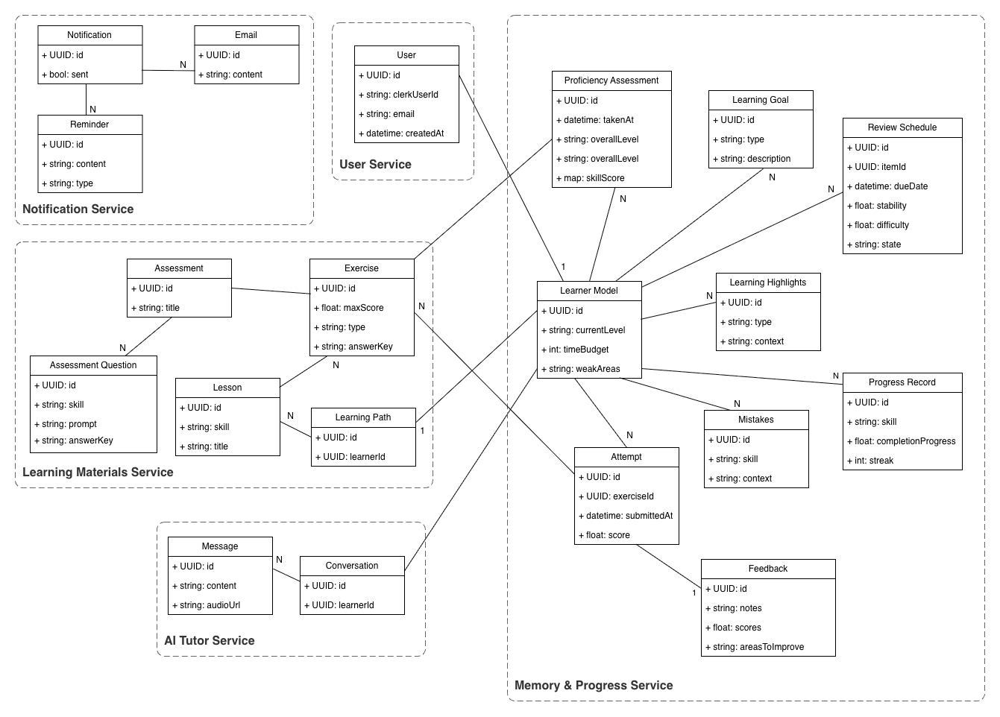
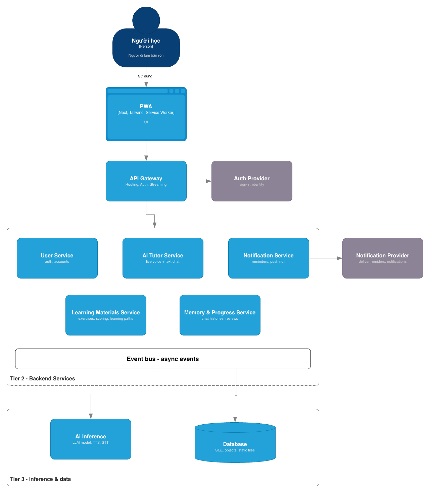
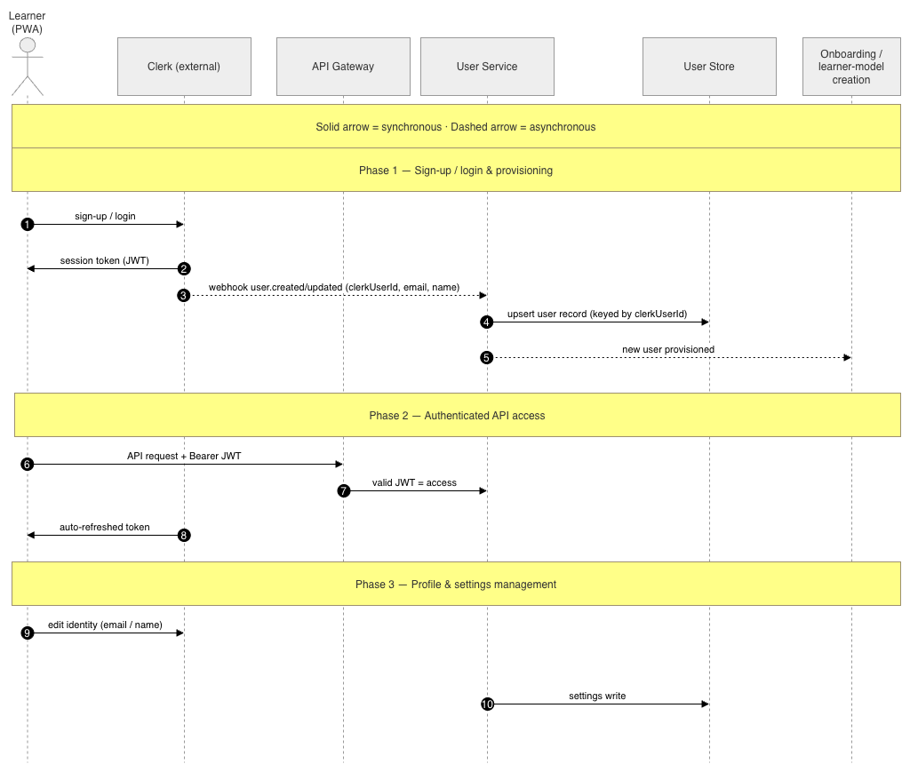
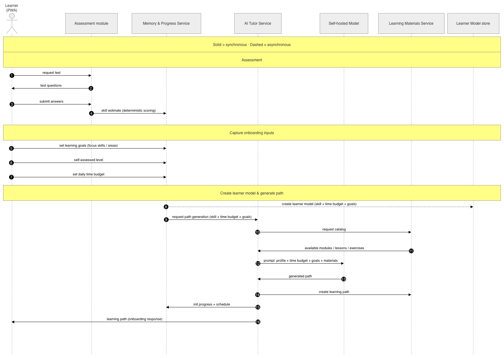
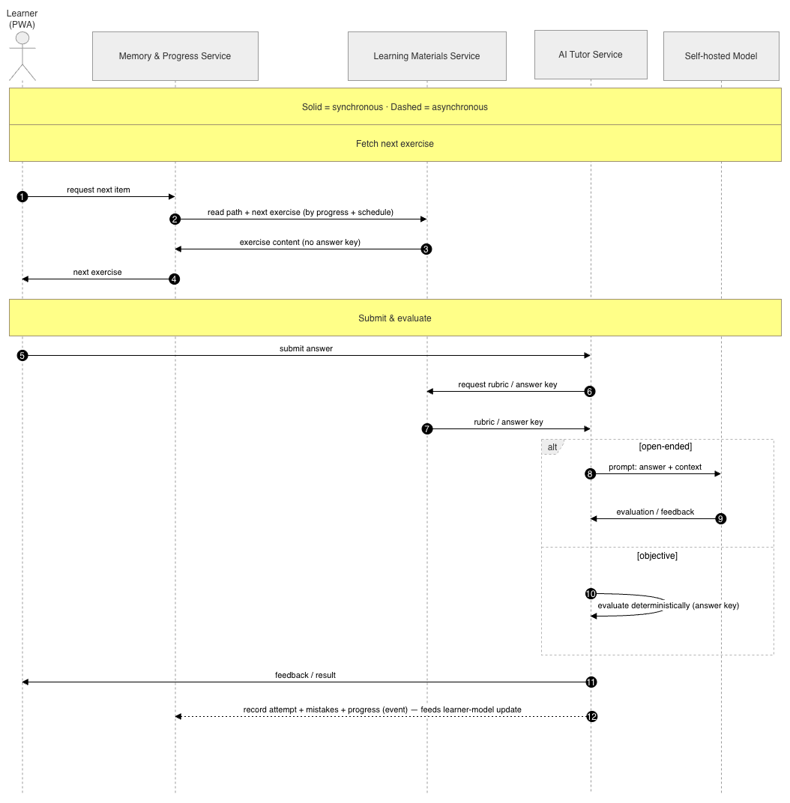
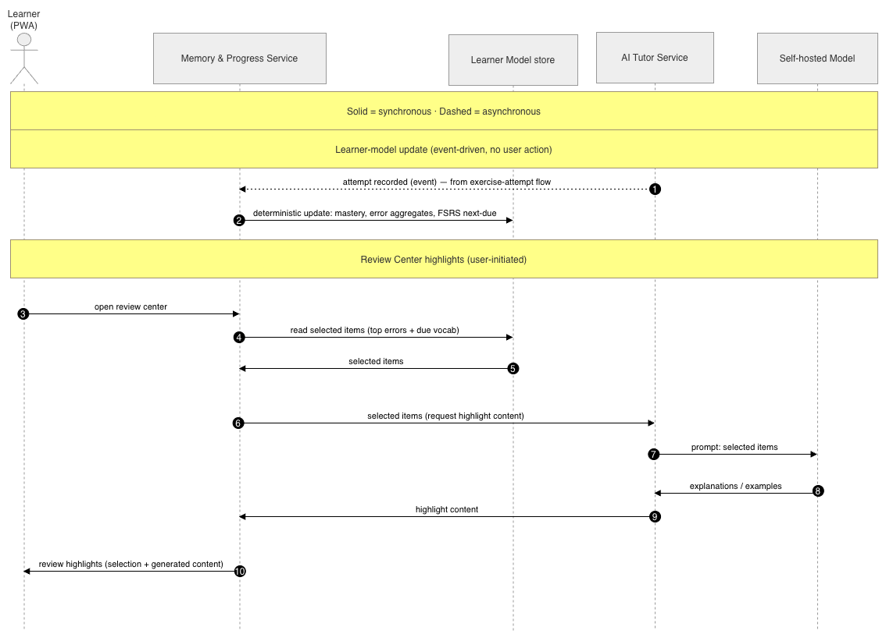
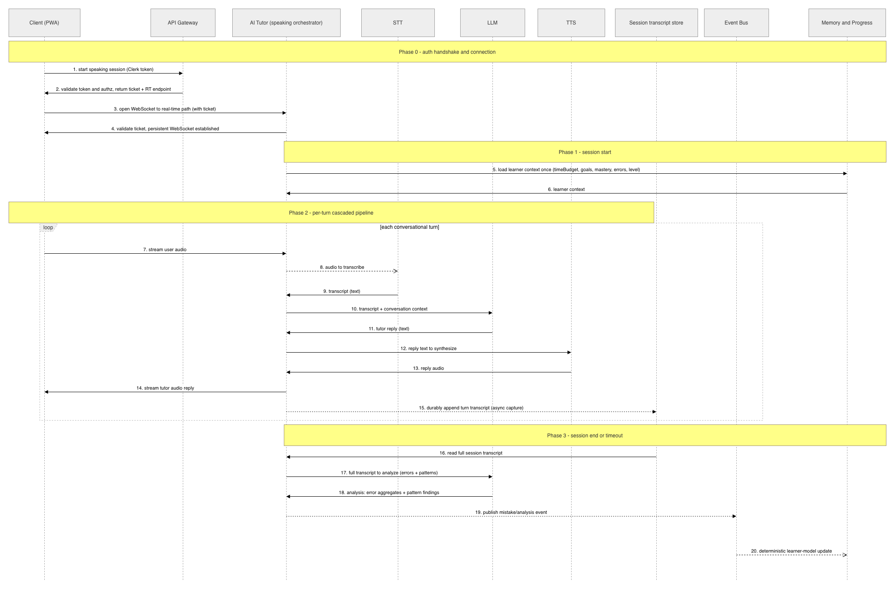
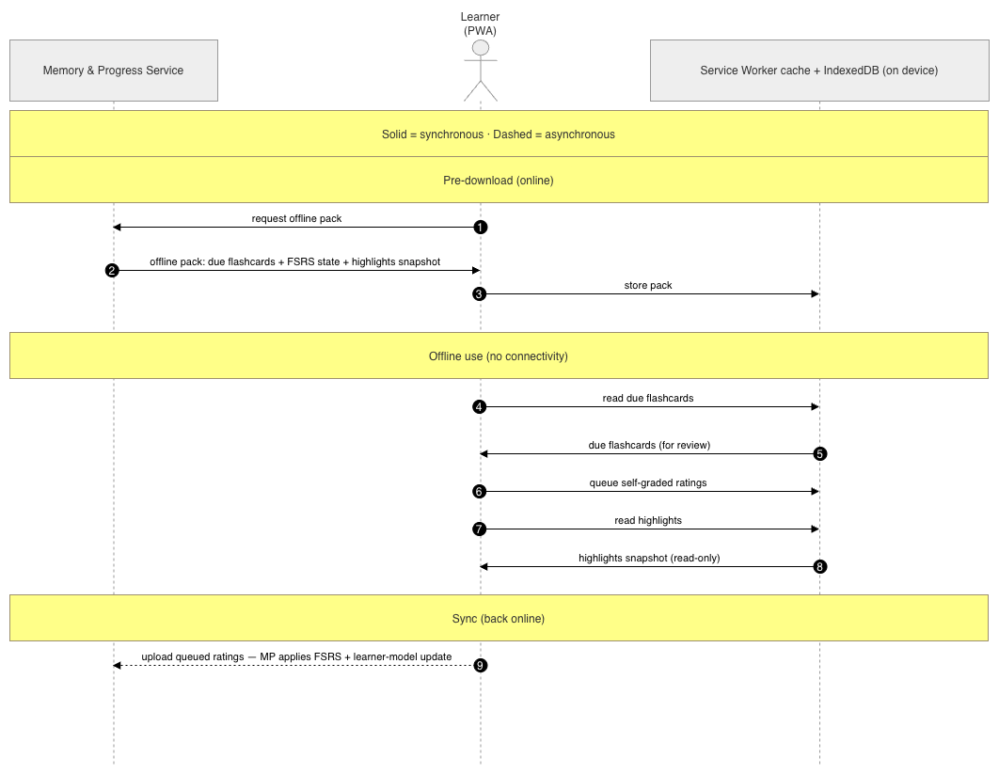
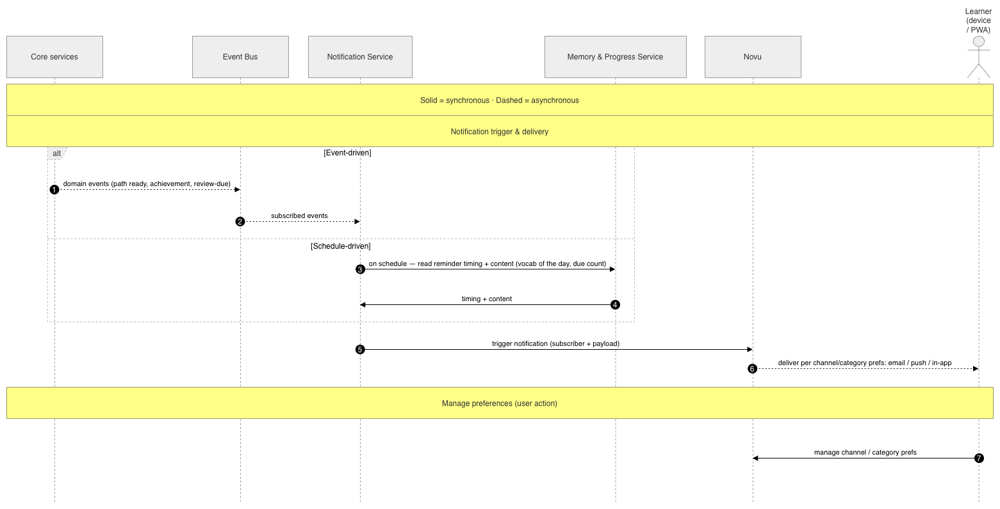

# PROJECT DESCRIPTION DOCUMENT

## Table of contents

- [1. Introduction](#1-introduction)
  - [1.1. Background](#11-background)
  - [1.2. Project overview](#12-project-overview)
- [2. Purpose of the software](#2-purpose-of-the-software)
  - [2.1. General purpose](#21-general-purpose)
  - [2.2. Specific purposes](#22-specific-purposes)
  - [2.3. Expected scope of impact](#23-expected-scope-of-impact)
- [3. User groups](#3-user-groups)
  - [3.1. Primary user group](#31-primary-user-group)
  - [3.2. Secondary user groups](#32-secondary-user-groups)
- [4. Functional requirements](#4-functional-requirements)
- [5. Non-functional requirements](#5-non-functional-requirements)
  - [5.1. Performance](#51-performance)
  - [5.2. AI accuracy](#52-ai-accuracy)
  - [5.3. Usability](#53-usability)
  - [5.4. Data security](#54-data-security)
  - [5.5. Scalability](#55-scalability)
  - [5.6. Reliability](#56-reliability)
- [6. Key features](#6-key-features)
  - [6.1 AI Learning Memory / Review Center](#61-ai-learning-memory-review-center)
  - [6.2 Personalized learning path](#62-personalized-learning-path)
  - [6.3 AI English Tutor / AI Conversation Agent](#63-ai-english-tutor-ai-conversation-agent)
  - [6.4 Full support for all four skills](#64-full-support-for-all-four-skills)
  - [6.5 Instant feedback and error correction](#65-instant-feedback-and-error-correction)
  - [6.6 Bilingual English-Vietnamese teaching](#66-bilingual-english-vietnamese-teaching)
  - [6.7 Exercise bank, scheduling reminders, and habit building](#67-exercise-bank-scheduling-reminders-and-habit-building)
  - [6.8 Summary of highlights](#68-summary-of-highlights)
- [7. System architecture](#7-system-architecture)
  - [7.1 Overall structure and layering](#71-overall-structure-and-layering)
  - [7.2 Services and data ownership](#72-services-and-data-ownership)
  - [7.3 Communication model](#73-communication-model)
  - [7.4 Cross-cutting concerns](#74-cross-cutting-concerns)
  - [7.5 Real-time speaking feature architecture](#75-real-time-speaking-feature-architecture)
  - [7.6 Future direction](#76-future-direction)
- [8. Data flows](#8-data-flows)
  - [8.1 User service](#81-user-service)
  - [8.2 Core features](#82-core-features)
  - [8.3 Notifications](#83-notifications)
- [9. AI Agent design](#9-ai-agent-design)
  - [Part A - AI Philosophy and Architectural Principles](#part-a---ai-philosophy-and-architectural-principles)
  - [Part B - AI Agent Architecture](#part-b---ai-agent-architecture)
- [10. Technology stack](#10-technology-stack)
  - [10.1 Technology overview](#101-technology-overview)
  - [10.2 Frontend](#102-frontend)
  - [10.3 Backend](#103-backend)
  - [10.4 Data layer](#104-data-layer)
  - [10.5 Infrastructure layer](#105-infrastructure-layer)
  - [10.6 External systems / providers](#106-external-systems-providers)
  - [10.7 Agentic AI layer](#107-agentic-ai-layer)

---

# 1. Introduction

## 1.1. Background

### 1.1.1. The English proficiency gap in the workplace

In commerce, technology, and international cooperation, the ability to communicate in English
is becoming a mandatory standard. In Vietnam, demand for English-proficient talent is rising
sharply as businesses expand into international markets. Yet the skills gap remains large: many
working professionals, despite years of studying English, still struggle with real-world
communication — from conversation and email to online meetings. The cause lies in outdated
learning methods and limited available time. **The solution required:** a flexible learning model
personalized to goals and work schedules, helping working professionals upgrade their English
skills effectively without disrupting their jobs.

### 1.1.2. Limitations of traditional English learning methods

Traditional English learning methods are outdated for working professionals. Fixed schedules,
rigid content, and slow feedback mean learning can't keep pace with the rhythm of work life.
Learners must follow a one-size-fits-all curriculum, with little personalization and few
opportunities to practice real communication. Meanwhile, large class sizes make it hard for
teachers to support individuals, and high-quality private tutoring is too expensive and not
easily accessible. **Result:** working professionals need a flexible, instantly responsive
English-learning solution, personalized to career goals, that lets them progress quickly without
being bound by time or location.

### 1.1.3. Limitations of current English learning apps

The English learning app market is booming, with platforms like Duolingo, Babbel, Rosetta
Stone, Coursera, iTalki, and ELSA Speak attracting hundreds of millions of users globally.
However, none of these platforms truly meets the needs of working professionals — a group that
needs professional communication skills, instant feedback, and a personalized learning path.

- Gamified apps: fun but shallow, lacking specialized/professional vocabulary.
- Video courses: linear, non-adaptive, low completion rates.
- In-person tutoring: expensive, inconsistent quality.
- Pronunciation apps: focus on only one skill.
- AI chatbots: lack a learner model and progress assessment.
- A clear market gap: there is no unified, AI-driven English learning ecosystem that integrates
  all four skills, provides real-time feedback, and is designed specifically for working
  professionals.

### 1.1.4. Why AI-driven personalization is needed

Personalization is the scientific foundation of effective learning. Research on spaced
repetition, mastery-based learning, and interleaved practice all demonstrate that when content is
tailored to each learner's pace and ability, retention and application outcomes far exceed those
of fixed methods. To achieve this, a system needs to deeply understand each learner: what they've
mastered, where they struggle, and when they need to review. Static curricula cannot do this. AI
is the key. An AI system can model learner state, predict knowledge decay, generate instant
feedback, and dynamically generate content — conversations, essays, or exercises — matched to the
learner's level and career goals. Result: learners are guided by a learning path that is
adaptive, intelligent, and more effective than any traditional model.

### 1.1.5. Why adaptive learning outperforms static courses

Traditional courses offer the same lessons, at the same pace, to everyone, ignoring differences
in level, available time, and career goals. The result: strong learners waste time, weaker
learners get left behind, and everyone studies content unrelated to their actual work. An
adaptive learning system turns the process into a personalized journey: the curriculum is
continuously updated based on each user's performance, automatically selecting content,
difficulty, and optimal timing to improve weak skills as fast as possible. Each session is no
longer a "one-size-fits-all lesson" but a precise intervention, designed by AI to maximize
progress and sustain motivation.

## 1.2. Project overview

### 1.2.1. Product vision

The platform is built as a Progressive Web App (PWA); the system acts as an intelligent English
learning assistant that doesn't just deliver content but deeply understands each learner: their
ability, habits, learning history, professional vocabulary, and free time. Every interaction —
from an exercise, a conversation, to pronunciation feedback — makes the platform more accurate,
creating an adaptive, effective, and fully personalized learning experience. Vision: every user
doesn't just learn English — they're accompanied by a system that understands that specific
learner and evolves with them, session after session.

### 1.2.2 Core objectives

- **Improve real-world proficiency:** users make clear progress on the CEFR framework — the
  goal is at least one level up after 60 hours of active study.
- **Readiness for professional communication:** develop the ability to use English in workplace
  contexts — meetings, email, presentations, negotiation, and technical discussion.
- **Sustain a lasting study habit:** behavioral design that encourages daily study, targeting a
  30-day retention rate above 70%.
- **Bilingual accessibility:** a Vietnamese-first interface and guidance, helping learners of
  every level easily start their English learning journey.

### 1.2.3. Scope

- A Progressive Web App (PWA) accessible via web browser on desktop and mobile devices, with
  offline capability for cached content.
- An AI agent system comprising multiple specialized agents responsible for profiling,
  curriculum generation, tutoring, feedback, assessment, memory management, review generation,
  and recommendation.
- Four integrated skill areas: Listening, Speaking, Reading, and Writing.
- A bilingual English/Vietnamese interface and explanation system.
- An exercise library with automatic difficulty calibration and spaced repetition scheduling.
- A conversational AI tutor interface supporting both text and voice.
- A Learning Memory and Review Center giving users access to their learning history and
  AI-generated review content.
- A habit-building and progress-tracking system with streaks, daily reminders, and long-term
  analytics.

### 1.2.4. Strategic differentiators

The AI English PWA platform stands out through its unique architecture and learning experience:

- **Persistent Learner Intelligence:** an AI model updated in real time, deeply understanding
  each learner and driving every learning decision.
- **Multi-agent AI architecture:** specialized agents coordinate to produce an expert-quality,
  consistent, and deep learning experience.
- **Integrated four-skill curriculum:** listening, speaking, reading, and writing are tightly
  connected; progress in one skill lifts overall language ability.
- **Professional context:** content, vocabulary, and feedback are all grounded in real
  work-communication scenarios.
- **Real-time multimodal feedback:** errors are corrected the moment a learner speaks, writes,
  or mispronounces something — enabling immediate improvement and long-term retention.
- **Adaptive bilingual explanations:** automatically switches between English and Vietnamese
  based on level, helping learners understand more easily and build confidence.

### 1.2.5. The platform as a connected learning ecosystem

The platform is not a collection of disconnected modules but a connected ecosystem where every
component interacts with and depends on the others. When a user completes a conversation
exercise, the Feedback AI Agent analyzes grammar, pronunciation, vocabulary, and fluency errors;
this data is written to long-term memory. The Progress Analysis AI Agent detects error patterns,
the Learning Path AI Agent schedules an appropriate review lesson, the Review Generation AI Agent
feeds the content into the spaced-repetition cycle, and the Memory AI Agent surfaces weak points
for the learner to revisit. The Habit-Building AI Agent sends optimally timed reminders based on
the learner's personal schedule. Every action — speaking, writing, completing or missing a
session — continuously updates the learner model, making the system progressively more accurate
and effective. This is the platform's core architectural principle.

# 2. Purpose of the software

## 2.1. General purpose

The AI-powered English Learning Platform was developed to close the English communication
competence gap among working professionals in Vietnam and Southeast Asia — a group not
effectively served by either traditional methods or existing commercial apps. The system provides
a personalized, adaptive, and continuously improving learning environment, where every user is
supported by a multi-agent AI architecture that deeply understands their ability, weaknesses,
career goals, and learning behavior.

## 2.2. Specific purposes

### 2.2.1. Enhancing professional communication competence

Help users develop the ability to use English practically in workplace situations — meetings,
email, presentations, negotiation, and technical communication — rather than focusing solely on
academic grammar knowledge.

### 2.2.2. Personalizing the learning journey

Replace the "one curriculum for everyone" model with a path that is continuously built and
adjusted based on each learner's real data, optimizing study time and accelerating the rate of
improvement.

### 2.2.3. Immediate, pedagogically grounded feedback

Provide immediate correction during practice. Unlike traditional delayed methods, this aligns
with the neuroscience of memory consolidation to maximize long-term learning effectiveness.

### 2.2.4. Supporting English learners at every level

Remove the comprehension barrier for lower-level users through an adaptive bilingual
English-Vietnamese explanation system, ensuring the language of instruction is never itself an
obstacle to learning English.

### 2.2.5 Supporting sustainable learning habit formation

Integrate behavioral-science mechanisms to build a consistent study habit that fits the busy
schedules of working professionals, rather than requiring long, fixed study blocks.

## 2.3. Expected scope of impact

The software aims to become the primary English-learning tool for working professionals in
Vietnam, targeting one full CEFR level of improvement for active learners after 60 hours of use,
while building a technical foundation scalable enough to serve millions of users across Southeast
Asia.

# 3. User groups

The application is designed for people who want to improve their English through daily study and
practice, particularly those with limited available time.

## 3.1. Primary user group

The primary user group the application targets is working professionals who want to devote a
small portion of their day to learning English. Because of demanding work schedules, they
typically don't have much time to attend traditional English courses or time-consuming online
courses.

The primary user group's needs include:

- Learning English in short blocks of time throughout the day.
- Practicing conversation, vocabulary, and grammar flexibly.
- Having a personalized learning path suited to their own level and goals.
- Tracking learning progress to stay motivated.

## 3.2. Secondary user groups

Beyond the primary user group, the application is also suitable for students who want to improve
their English skills, and for self-directed English learners.

The secondary user groups' needs include:

- Practicing English daily through short exercises.
- Accessing learning content matched to their current level.
- Improving listening, speaking, reading, and writing skills.
- Receiving feedback and suggestions to fix common mistakes.
- Sustaining a study habit through interactive activities and daily reminders.
- Learning English at low cost and with flexible timing.

# 4. Functional requirements

Below is the list of the product's functional requirements. Functional requirements describe the
core capabilities the product must provide to meet user needs. The functional requirements listed
below serve as the basis for the product's design, development, and testing process.

- The system allows users to register and log in with a Google account or with email and
  password.
- The system collects information about the user's learning goals (e.g., communication, work,
  travel, exams).
- Users can take an initial English proficiency assessment test, or self-select their English
  level.
- An AI Agent analyzes the assessment results and learning goals to build a personalized learning
  path for each user.
- The system allows users to practice Reading, Listening, and Writing skills by completing
  exercises and tests matched to their learning path and level.
- The system grades users' practice exercises and tests, and displays learning progress through
  metrics, charts, or statistics.
- The system allows users to practice Speaking skills through live voice conversation with an AI
  Agent. The AI Agent responds to the conversation in real time to simulate communication with a
  real person.
- The AI Agent explains vocabulary, phrases, or grammar structures the user doesn't understand
  during the conversation. The system supports communication in both English and Vietnamese to
  support users at different levels.
- The AI Agent provides feedback after each speaking practice session, covering pronunciation,
  vocabulary, grammar, and fluency, as well as detailed feedback on learning results and errors to
  improve across other skill practice.
- The system has a flashcard feature, which can be displayed as a notification, allowing users to
  practice and build vocabulary.
- The system is developed as a Progressive Web Application, allowing users to easily access it via
  browser on multiple device types (computer, phone, etc.), as well as install it to the home
  screen and use it like a regular app.

# 5. Non-functional requirements

## 5.1. Performance

- The system must respond to user actions within a short time to ensure a seamless learning
  experience.
- The system must process real-time conversation with low latency to support effective Speaking
  practice.

## 5.2. AI accuracy

- The AI Agent must accurately recognize and process the user's spoken content.
- The AI Agent must provide feedback appropriate to the context of the conversation.
- Recommendations about learning paths, level assessment, and learning feedback must be highly
  accurate and consistent.

## 5.3. Usability

- The user interface must be intuitive, easy to understand, and user-friendly.
- The interface design must be consistent, easy to scan, and minimize confusion during use.
- New users should be able to use the main functions without complex instructions.

## 5.4. Data security

- Users' personal data and learning history must be stored securely.
- The system must apply appropriate authentication and authorization mechanisms to prevent
  unauthorized access.

## 5.5. Scalability

- The system must be designed with an architecture that allows new features to be added without
  significantly affecting existing functionality.
- The system must be able to support a growing number of users in the future.

## 5.6. Reliability

- The system must detect and handle errors appropriately to avoid data loss.
- The system must maintain high uptime under normal operating conditions.
- The system must ensure core functions are always available to users.

# 6. Key features

The application will focus on helping users learn English in a practical, personalized way, with
the ability to track their learning process over the long term. The key features are built to
help learners not just practice vocabulary or grammar in isolation, but apply English to
workplace situations, everyday communication, and develop a consistent study habit.

## 6.1 AI Learning Memory / Review Center

This is the center for remembering and reviewing the user's learning process. Users can revisit
conversations with the AI, grammar mistakes they've made, vocabulary they've learned,
pronunciation errors, past lessons, and weak points to improve. Based on this learning history,
the system can automatically generate tests, review sessions, or suggest appropriate learning
content. This is an important differentiator for the application, since learners don't lose data
after each practice session — instead they can look back at their entire learning journey.

## 6.2 Personalized learning path

The application builds a learning path based on the user's level, goals, free time, and work
schedule. For example, a user can choose a goal such as workplace communication, writing email,
interviewing, presenting, or improving pronunciation. From there, the system recommends lessons,
exercises, and a schedule suited to them, instead of applying the same curriculum to everyone.

## 6.3 AI English Tutor / AI Conversation Agent

Users can practice English through voice chat or text chat with the AI. The AI acts as a tutor or
conversation partner, helping learners practice in realistic scenarios such as workplace
communication, meetings, interviews, phone calls, writing emails, or everyday conversation. This
feature helps learners build reflexes and use English more naturally.

## 6.4 Full support for all four skills

The application supports listening, speaking, reading, and writing practice, rather than
focusing only on vocabulary or grammar. Users can listen to sample dialogues, practice speaking
with the AI, read short work-themed content, and practice writing emails or answers. Combining
all four skills makes the learning process more balanced and better suited to using English in
the workplace.

## 6.5 Instant feedback and error correction

After each exercise or speaking practice session, the AI provides feedback on grammar,
pronunciation, word usage, expression errors, and writing style. Feedback is explained clearly so
users understand why they were wrong and how to fix it. This feature helps learners improve
immediately during practice, rather than just receiving a right-or-wrong result.

## 6.6 Bilingual English-Vietnamese teaching

The application can explain content in both English and Vietnamese, making it easier for learners
to understand — especially those who've lost their foundation or busy learners without much time
to look things up themselves. For example, the AI can explain sentence structure, vocabulary,
grammar, or mistakes in Vietnamese, then provide English examples so learners can apply them
easily.

## 6.7 Exercise bank, scheduling reminders, and habit building

The application provides many types of exercises such as multiple choice, fill-in-the-blank,
sentence correction, listening practice, speaking practice, writing emails, and scenario-based
conversation. In addition, the system can send study reminders, track progress, and encourage
users to maintain a consistent daily study habit. This feature is especially well-suited to
working professionals, since they're often busy and prone to dropping their studies without a
reminder-and-tracking system.

## 6.8 Summary of highlights

The application's standout feature is the **AI Learning Memory / Review Center**, because it lets
learners preserve their entire learning process and turns learning history into personalized
review content. Instead of just studying isolated lessons, users can see how they've progressed,
what mistakes they commonly make, and what they need to practice more. Combined with the AI
Tutor, the personalized learning path, and instant feedback, the application aims to create a
practical, flexible English learning experience suited to working professionals.

# 7. System architecture

*Figure 2: System class diagram*

The system is a Progressive Web App (PWA) for learning English, aimed at busy working
professionals. The platform's AI capability is a mixed stack, not self-hosted end-to-end: the LLM
and STT paths are routed primarily through free-tier third-party cloud APIs (Groq, then
OpenRouter), with a self-hosted Ollama instance — CPU-only, no GPU — kept only as a last-resort
backstop when those are rate-limited or unavailable; the tutor's TTS voice runs entirely
client-side via the browser's own `SpeechSynthesis` API. Staying inside those free-tier rate
limits, not GPU capacity, is the top-level architectural concern that shapes many decisions in
the layers below (see §10.7 for the full inference tech stack). On
the product side, the system aims for an agentic learning loop, an AI-assisted Review Center, a
personalized learning path, coverage of all four skills (reading, listening, writing, speaking),
and bilingual English-Vietnamese feedback.

The architecture follows a pragmatic, phased philosophy: validate a feature with a simple,
easy-to-operate solution first, and only move to a more complex solution when scale or quality
requirements genuinely demand it. This philosophy recurs across many of the specific choices
below — for example, preferring WebSocket over WebRTC, or using a cascaded pipeline instead of a
single end-to-end speech-to-speech model.

## 7.1 Overall structure and layering

The system is organized into three layers:

- **Client layer:** the PWA with a Service Worker and IndexedDB for offline capability.
- **Edge (gateway) layer:** the API Gateway, the entry point for traffic from client to backend.
- **Layer 2 - Backend services:** five business services (User, AI Tutor, Learning Materials,
  Memory & Progress, Notification) communicating asynchronously through an Event Bus.
- **Layer 3 - Inference and data:** LLM/STT inference via a 3-tier router (Groq → OpenRouter →
  a self-hosted, CPU-only Ollama backstop) plus client-side TTS, alongside a storage layer
  comprising per-service PostgreSQL, Redis (server-side cache), and an object store for
  audio/static files.

Two external providers participate in the system: Clerk handles identity/login, and Novu handles
notification delivery. The container diagram describes these components and relationships in
full; the class diagram describes the per-service data entities.

## 7.2 Services and data ownership

The overarching principle is a clean separation between **immutable curriculum content** and
**dynamic learner state**, with each service owning only the data within its scope. Services
reference each other **only by ID**, never through shared tables or object links; this keeps
services loosely coupled and lets each own its own data store.

**User Service** holds only the account mirror (synced from Clerk by *clerkUserId*) and settings
unrelated to learning. Real identity belongs to Clerk; the backend mirrors identity via webhook
and never stores passwords.

**Memory & Progress Service** owns all dynamic learner state: the learner model (current level,
*timeBudget*, learning goals, weak zones), progress, the FSRS schedule, mistakes, highlights for
the Review Center, and attempt records plus feedback. Consolidating all data that changes per
learner into one service keeps the entire *attempt → mistakes → learner-model update →
highlights* chain within a single scope. (This is also why attempts and feedback live here rather
than in Learning Materials: they are dynamic, per-learner data, not content.)

**Learning Materials Service** owns immutable content: exercises, lessons, learning paths, answer
keys, and an Assessment module containing a fixed, deterministic assessment question bank.
Once created, a learning path is **immutable**: adaptation is done by regenerating a new path,
never modifying the old one — so the content a learner is currently following stays stable and
consistently referenceable.

**AI Tutor Service** is a lightweight orchestrator. It orchestrates live speaking/writing
conversation, orchestrates exercise grading/assessment, generates learning paths via the
LLM router (Groq → OpenRouter → self-hosted Ollama, §10.7.1), and is the **only** service that
calls the inference layer. It owns conversations and messages.

**Notification Service** owns reminder timing and content. Novu owns delivery plus channel/
category preferences; authentication/login email belongs to Clerk (out of scope for this
service).

## 7.3 Communication model

**The API Gateway is the single entry point** for traffic from client to backend, centralizing
routing, authentication, and observability in one place. The system currently has **no RBAC**: a
valid token means full access, but the authorization gate is kept structurally in place for
future expansion.

There is **exactly one deliberate exception** to the single-entry-point rule: the speaking
feature's WebSocket. Under a hybrid ingress model, the API Gateway only performs the
authentication handshake (checking the Clerk token, applying the authz gate, and issuing a
short-lived session ticket); the audio stream then connects directly to the AI Tutor's real-time
path, bypassing the Gateway. This keeps authentication centralized while removing one hop from
the latency-sensitive path.

The system follows a clear **sync/async discipline**: live/streaming flows and operations the
user waits on are synchronous; persistence, SRS scheduling, and notifications are asynchronous,
going through the Event Bus. The Event Bus decouples event producers from consumers — for
example, an exercise attempt is recorded as an event that then triggers a learner-model update,
and progress events can trigger notifications.

## 7.4 Cross-cutting concerns

**Identity and authentication.** Clerk is the external source of identity; the backend mirrors
identity by *clerkUserId* via webhook and never stores passwords. The API Gateway authenticates
the token on every regular request. As noted, authorization today is only a structural gate, with
no role differentiation yet.

**Third-party inference with a self-hosted backstop.** This is a constraint that shapes many
decisions. The LLM is a shared resource reached through a 3-tier router — Groq, then
OpenRouter's free tier, then a self-hosted Ollama instance as a CPU-only backstop — used for path
generation, open-ended-answer grading, and generating highlight explanations. STT is a direct
call to Groq's cloud Whisper API, falling back to the browser's own Web Speech API on rate-limit;
TTS runs entirely client-side via the browser's `SpeechSynthesis` API, with no backend service at
all. All model access is routed **only through the AI Tutor**, which keeps the access path — and
the free-tier rate limits behind it — explicit and centralized, even though most of the
components themselves live outside the system's own infrastructure.

**Caching (Redis).** Redis serves as the server-side caching layer: volatile, millisecond
latency, and TTL self-expiry. It complements PostgreSQL (the durable, per-service source of
truth), is distinct from the Service Worker's client-side cache, and is not the Event Bus. Redis
holds data with at least one of three properties: short-lived, shared across multiple instances,
or expensive to recompute but safe to cache.

**Offline capability.** Offline scope is deliberately limited: only flashcards (self-graded SRS)
and review highlights (a cached, read-only snapshot). Lessons, modules, and exercises still
require connectivity. The flow has three phases: prefetch while online → offline practice
(queuing ratings) → sync on reconnect (deterministic FSRS updates). There are no answer keys and
no model involved in offline mode; data lives in the Service Worker cache and IndexedDB. This
scoping delivers offline value without exposing answer keys or the model.

## 7.5 Real-time speaking feature architecture

The speaking practice feature is the system's only real-time flow and is where many
architectural decisions concentrate.

**Transport protocol.** The system starts with WebSocket to validate the feature and complete the
pipeline, treating WebRTC as a future upgrade path once quality demands it. WebSocket fits the
"orchestrator holds the connection" model and the existing Gateway model, and is simpler.
WebRTC's complexity (signaling, STUN/TURN, ICE, a media server/SFU) is only worth it once low
latency and natural conversation are needed at a level WebSocket can't meet.

**Processing pipeline.** Every speaking turn is processed through a cascaded pipeline: audio →
STT → LLM → TTS → audio. A cascaded pipeline is modular, reuses mature hosted and client-side
components (Groq's Whisper API, the shared LLM router, the browser's own TTS) rather than
requiring a custom speech-to-speech model, and —importantly—produces a **text transcript**, which
both the learner model and the error-logging mechanism need, while reusing the shared LLM.

**Learner context** is loaded once at the start of the session, rather than being reloaded every
turn.

**Error logging.** Each turn's transcript is persisted deterministically (no model call); when
the session ends or times out, a **single** model analysis pass runs over the entire transcript
to extract errors and error patterns (vocabulary, grammar, fluency, coherence). This fits working
professionals, who care more about overall communication competence than isolated errors, and is
robust to a user abandoning the session mid-way thanks to the timeout-triggered mechanism.
Pronunciation feedback is deliberately deferred as a separate feature: pronunciation assessment
needs to analyze **audio** (the LLM in the pipeline only sees text), so it naturally belongs to a
separate per-turn processing branch and can be added later without breaking the design.

**Hybrid ingress.** As described in the communication section, the authentication handshake goes
through the Gateway (issuing a short-lived ticket), while the audio stream connects directly to
the AI Tutor — the one deliberate exception to the single-entry-point rule.

## 7.6 Future direction

As the number of AI features grows, the AI Tutor today handles all model-driven work. In the
future this could be split into a three-layer architecture: the **business services** (unchanged),
a per-skill **AI feature service** layer (Speaking Tutor, Reading Tutor, …) owning that skill's own
orchestration logic, and a **shared inference-access layer** managing GPU resource contention
(queuing, batching, prioritization, backpressure). The speaking feature, with its very different
operating profile (persistent connection, real time, audio), is the natural first candidate to
split out. Pronunciation feedback is an add-on feature that can be attached later (one more
service, a per-turn audio branch, and one async event).

# 8. Data flows

This chapter describes the system's overall data flows — how data is created, read, updated, and
moved between components. Content is organized into three groups following the system's
dependency order: (1) the user service, covering authentication, token refresh, and access
control, a prerequisite for every other flow; (2) the core features, centered on the learner
model as a central data store that most flows read from or write to, including onboarding, path
generation, exercise attempts and progress updates, and real-time speaking; and (3) the
notification service, whose flows consume events generated by the core features. Throughout, the
document distinguishes synchronous from asynchronous flows to accurately reflect the
communication style between services.

## 8.1 User service

*Figure 3: User service flow diagram*

Authentication and token issuance are handled by Clerk (an external service). Every request from
client to backend goes through the API Gateway, which checks the token before routing. The User
Service stores a mirror of user identity, keyed by *clerkUserId*.

Components:

- **Learner (PWA):** the client, integrating the Clerk SDK.
- **Clerk:** handles registration, login, and issuing/refreshing tokens.
- **API Gateway:** the backend entry point; checks tokens and routes requests.
- **User Service:** manages the identity mirror, profile, and app settings.
- **User Store:** stores user records and settings.

**Registration and login**

The PWA sends registration/login requests to Clerk via the Clerk SDK; Clerk returns a session
token (JWT) to the client. In parallel, Clerk fires a webhook containing *clerkUserId*, email, and
name to the User Service; the User Service *upserts* the user record into the User Store by
*clerkUserId*. This new record is the input for initializing the learner model.

**Token refresh**

Tokens are refreshed directly between the PWA and Clerk (via the Clerk SDK); the backend is not
involved. The backend only receives and validates the token's validity on each request.

**Authentication and access control**

Every request to a protected resource carries a JWT (Bearer). The API Gateway verifies the
signature (against Clerk's JWKS) and the token's expiry: if valid, it routes to the target
service; if invalid, it rejects the request at the gateway.

**Profile and settings management**

User data is split by ownership:

- Identity (email, name): edited directly in Clerk, synced to the User Service via webhook.
- App settings (study duration, personal preferences): sent through the API Gateway → User
  Service → written to the User Store, as an ordinary authenticated request.
- Learning state (the learner model): belongs to the core-features domain.

All three data groups are linked together via *clerkUserId*.

## 8.2 Core features

### 8.2.1 Onboarding

*Figure 4: Onboarding flow diagram*

This flow initializes the learner model for a new user and generates a personalized learning
path. The user provides initial input in one of two ways — taking a built-in assessment
(deterministic scoring) or self-assessing their level — along with daily study duration and
learning goals. Once the learner model is created, the system generates a learning path in the
same session (synchronously); the user can only access learning content once the path is ready.
As in Section 8.1, every client-to-backend call goes through the API Gateway and is omitted from
the diagram for brevity.

Components:

- **Learner (PWA):** the client that collects onboarding input.
- **Assessment module:** manages the assessment question bank and deterministic scoring.
- **Learning Materials Service:** manages the content catalog (modules/lessons/exercises) and
  owns the learning path once created.
- **Memory & Progress Service:** owns the learner model, progress, and schedule.
- **AI Tutor Service:** orchestrates the agents; generates the learning path.
- **LLM router:** the 3-tier Groq → OpenRouter → self-hosted-Ollama router (§10.7.1) that
  generates path content from a prompt.

**Input assessment and learner-model creation**

The user initializes their profile via one of two branches:

- **Assessment branch:** the PWA fetches a question set from the Assessment module and submits
  answers; the Assessment module scores deterministically and returns a skill estimate to the
  Memory & Progress Service.
- **Self-assessment branch:** the PWA sends a self-assessed level directly to the Memory &
  Progress Service.

In both branches, the user simultaneously sets a daily study duration and learning goals
(skills/areas to focus on). The Memory & Progress Service creates the learner model from this
level, duration, and goals.

**Learning-path generation**

Path generation happens synchronously. The Memory & Progress Service sends a path-generation
request (with level, duration, goals) to the AI Tutor Service. The AI Tutor Service reads the
available content catalog from the Learning Materials Service, then sends a prompt (learner
profile + duration + goals + content) to the LLM router. The router returns the generated
path; the AI Tutor Service saves the path to the Learning Materials Service and initializes
progress + schedule in the Memory & Progress Service. The path is returned to the PWA as the
result of onboarding.

### 8.2.2 Exercise Attempt

*Figure 5: Exercise attempt flow diagram*

This flow serves the main learning loop: fetch the next exercise, the user completes it, the
system grades it and records the result. Grading happens synchronously (the user waits for a
response) and depends on the exercise type: objective exercises are graded deterministically,
open-ended ones are graded by the LLM router. The attempt result is recorded asynchronously
after the response has been returned. As in Section 8.1, every client→backend call goes through
the API Gateway and is omitted from the diagram for brevity.

Components:

- **Learner (PWA):** the client that displays the exercise and submits the answer.
- **Learning Materials Service:** provides the path, exercise content, and answer keys/grading
  criteria.
- **Memory & Progress Service:** owns the learner model, progress, and schedule; determines the
  next exercise and records the result.
- **AI Tutor Service:** orchestrates grading.
- **LLM router:** grades open-ended exercises (Groq → OpenRouter → self-hosted Ollama, §10.7.1).

**Fetching the next exercise**

The PWA requests the next exercise from the Memory & Progress Service. Based on progress and
schedule (including items due for review), the service determines the next item, reads the path
and exercise content from the Learning Materials Service, and returns the exercise to the PWA.
The answer key is never sent to the client — it stays server-side.

**Submitting and grading**

The PWA sends the answer to the AI Tutor Service. The AI Tutor Service reads the grading
criteria/answer key from the Learning Materials Service, then grades according to type:
open-ended answers are sent (with context) to the LLM router for grading; objective
answers are graded deterministically by the AI Tutor Service, with no model call. Feedback is
returned to the PWA within the same request.

**Recording the result**

After returning feedback, the AI Tutor Service records the attempt, the errors, and updates
progress in the Memory & Progress Service as an asynchronous event.

### 8.2.3 Learner Model Update and Review/Vocab Highlight

*Figure 6: Learner model update flow diagram*

This flow has two parts that run at different times. The update part runs asynchronously after
each attempt, using deterministic logic to update the learner model. The highlight-generation
part runs synchronously when the user opens the Review Center, using a hybrid mechanism: items
are selected by deterministic logic, and the LLM router then generates the explanatory
content. As in 8.1, every client→backend call goes through the API Gateway and is omitted from
the diagram for brevity.

Components:

- **Learner (PWA):** the client that opens the Review Center and displays highlights.
- **Memory & Progress Service:** owns the learner model, progress, and schedule; performs
  deterministic updates and highlight-item selection.
- **AI Tutor Service:** orchestrates highlight-content generation.
- **LLM router:** generates explanations/examples for selected items (Groq → OpenRouter →
  self-hosted Ollama, §10.7.1).
- **Learner Model store:** stores mastery levels, error statistics, and the FSRS schedule.

**Learner-model update (after each attempt)**

The attempt-recorded event (from the exercise-attempt flow) is received asynchronously by the
Memory & Progress Service. The service uses deterministic logic to update mastery levels, error
statistics, and the next review time (FSRS), then writes to the Learner Model store. This step
makes no model call — it reads errors already labeled during the grading step of the
exercise-attempt flow.

**Reading the Review Center (highlight generation)**

When the user opens the Review Center, the Memory & Progress Service selects the items to
highlight using deterministic logic (common mistakes, vocabulary due for review) from the Learner
Model store. The selected items are sent to the AI Tutor Service; the AI Tutor Service sends a
prompt to the LLM router to generate explanations/examples and returns the content. The
Memory & Progress Service merges the selection with the generated content and returns it to the
PWA. Highlights are data derived from the learner model, with no dedicated store of their own;
generated content can be cached to avoid re-calling the model on every open.

### 8.2.4 Real-time Speaking

*Figure 7: Real-time Speaking flow diagram*

This flow describes real-time conversational speaking practice between the learner and the AI
Tutor. The connection uses a persistent WebSocket held by the AI Tutor acting as orchestrator.
After the authenticated connection-setup step, every speaking turn is processed through a
cascaded pipeline: audio → STT → LLM → TTS → audio. Learner context is loaded once at the start
of the session. Each turn's transcript is persisted within the session scope; when the session
ends (or times out), a single analysis pass over the entire transcript generates error data to
update the learner model.

Components:

- **Client (PWA):** the learner's interface; captures and plays audio over WebSocket.
- **API Gateway:** performs the authentication handshake (checking the Clerk token and the authz
  gate), issues a short-lived session ticket. Not on the audio path.
- **AI Tutor (speaking orchestrator):** holds the WebSocket; orchestrates the per-turn pipeline;
  loads context at session start; persists per-turn transcripts; performs end-of-session
  analysis and emits events.
- **STT:** converts audio → text via Groq's cloud Whisper API, falling back to the browser's Web
  Speech API on rate-limit (§10.7.2). Not a self-hosted service.
- **LLM router:** generates the tutor's response (per turn) and analyzes the transcript
  (end of session). A shared 3-tier resource — Groq, then OpenRouter's free tier, then a
  self-hosted Ollama backstop (§10.7.1).
- **TTS:** converts text → audio via the browser's own `SpeechSynthesis` API, entirely
  client-side (§10.7.3) — not a backend service at all.
- **Session transcript store:** persistently stores per-turn transcripts within the session
  scope; the read source for the end-of-session analysis step.
- **Event Bus:** the async channel carrying error/analysis events.
- **Memory & Progress Service:** receives the end-of-session event; updates the learner model
  deterministically (FSRS + mastery + error aggregation) and stores error-pattern findings.

**Phases and data flow**

**Phase 0 - Authentication handshake and connection setup (steps 1-4)**

- The client sends a request to start a speaking session to the API Gateway, with the Clerk token
  (synchronous).
- The API Gateway authenticates the token and applies the authz gate, returning a short-lived
  session ticket plus the real-time endpoint address (synchronous).
- The client opens a WebSocket directly to the AI Tutor's real-time path, with the ticket
  (synchronous).
- The AI Tutor validates the ticket and establishes the persistent WebSocket (synchronous).

**Phase 1 - Session initialization (steps 5-6)**

- The AI Tutor loads learner context once from Memory & Progress: timeBudget, learning goals,
  mastery level, error history, level (synchronous).
- Memory & Progress returns the learner context (synchronous).

**Phase 2 - Per-turn loop, cascaded pipeline (steps 7-14, repeated each turn)**

- The client streams the learner's audio over WebSocket (synchronous/streaming).
- The AI Tutor sends the audio to Groq's cloud Whisper API to convert it to text (synchronous).
- Groq returns the transcript (text) to the AI Tutor (synchronous).
- The AI Tutor sends the transcript plus conversation context to the LLM router (synchronous).
- The LLM router returns the tutor's response as text (synchronous).
- The AI Tutor sends the response text to the client over WebSocket (synchronous/streaming) — no
  audio is generated or sent by the server for this step.
- The client synthesizes the response locally via the browser's own `SpeechSynthesis` API.
- The AI Tutor persists the turn's transcript to the Session transcript store (asynchronous; off
  the conversation processing path).

**Phase 3 - Session end or timeout (steps 15-19)**

- When the session ends or times out, the AI Tutor reads the entire session transcript from the
  Session transcript store (synchronous).
- The AI Tutor sends the full transcript to the LLM router for analysis (synchronous).
- The LLM router returns the analysis result: error aggregation and error-pattern findings
  (synchronous).
- The AI Tutor emits an error/analysis event to the Event Bus (asynchronous).
- Memory & Progress consumes the event and updates the learner model deterministically (FSRS +
  mastery + error aggregation), and stores error-pattern findings (asynchronous).

**Data ownership**

- **Memory & Progress** owns the learner model, progress, and FSRS schedule; it is where
  end-of-session analysis results are received and applied.
- **Session transcript store** holds the transcript within session scope, serving the
  end-of-session analysis (even for an abandoned session, thanks to the timeout-triggered
  mechanism).
- The learner-model update step (the last step of Phase 3) is deterministic. The end-of-session
  LLM router call performs error labeling and assessment for the speaking practice.
- The Review Center's highlights are generated lazily at read time, outside this flow.

### 8.2.5 Offline Activity

*Figure 8: Offline activity flow diagram*

In offline mode, the app only supports flashcard review (self-graded via the SRS mechanism) and
viewing review highlights (read-only); lessons, modules, and exercises require a network
connection. The flow has three phases by connectivity state: prefetch while still online, offline
practice, and sync on reconnect. Since this scope needs no answer keys or model, answer-key data
never leaves the server and the LLM router is not called.

Components:

- **Learner (PWA):** the client that performs review and manages the local queue.
- **Service Worker cache + IndexedDB:** on-device storage holding the offline data package.
- **Memory & Progress Service:** provides the offline data package and receives sync results;
  applies FSRS/learner-model updates.

**Prefetch**

The PWA requests an offline data package from the Memory & Progress Service. The service bundles
flashcards due for review, their corresponding FSRS state, and the latest highlight snapshot,
then returns it to the PWA. The PWA stores this package in on-device cache.

**Offline practice**

Everything happens on-device, with no network. The cache provides flashcards to review and
highlight snapshots to view (read-only). The user self-grades each card; the results (FSRS
memory-strength ratings) are placed in a local queue.

**Sync (once reconnected)**

The Service Worker automatically uploads the queued results to the Memory & Progress Service.
The service applies FSRS and learner-model updates using deterministic logic — the same logic as
the learner-model-update flow, but with replayed offline review results as input.

## 8.3 Notifications

*Figure 9: Notification flow diagram*

The Notification Service is the sole owner of notification logic, receiving input in two ways:
event-driven, via the Event Bus, and schedule-driven, via its own scheduler. Both converge on the
Notification Service, which then calls Novu to deliver via email/push/in-app. Authentication/
login email is handled by Clerk and is out of scope for this flow.

Components:

- **Learner (device / PWA):** where notifications are received and channel preferences are
  managed.
- **Core services:** emit business events.
- **Event Bus:** delivers events to subscribers.
- **Notification Service:** consumes events and runs the scheduler; triggers Novu.
- **Memory & Progress Service:** provides reminder timing and content for scheduled
  notifications.
- **Novu:** multi-channel delivery; stores and applies channel preferences.

**Event-driven notifications**

Services emit business events (e.g., path ready, achievement unlocked, review due) to the Event
Bus asynchronously. The Notification Service subscribes to and consumes these events, then
decides on the corresponding notification.

**Scheduled notifications**

The Notification Service's scheduler fires on a time basis (daily study reminder, vocab/flashcard
of the day). When triggered, the Notification Service reads each user's reminder timing and the
content it needs (vocab of the day, count of items due) from the Memory & Progress Service to
build the notification.

**Delivery and preferences**

In both flows, the Notification Service triggers Novu (with subscriber and content). Novu
delivers via email/push/in-app and applies each user's channel/notification-type preferences.
Users manage channel preferences directly in Novu; reminder timing (tied to the study-time
budget), however, is a business-domain concern and is provided to the scheduler. Subscriber
identity is synced to Novu by user ID (same pattern as Section 8.1).

# 9. AI Agent design

## Part A - AI Philosophy and Architectural Principles

### A.1. Why multi-agent is needed

A monolithic AI model, while simple in form, cannot simultaneously handle distinct cognitive
tasks: from real-time speech analysis, long-term study planning, conversation simulation, to
predicting the forgetting curve. Each task has its own latency, data, and compute-configuration
requirements; bundling them all into a single model leads to capacity conflicts and makes
optimization difficult. A multi-agent architecture allows independent upgrades: the pronunciation
assessment module, the study-planning module, or the review-scheduling module can each be
improved independently without affecting the whole system. As a result, the platform sustains
performance and scalability throughout its operating lifecycle — something a monolithic
architecture cannot achieve.

### A.2. Why a Monolithic AI Assistant Isn't Capable Enough

A monolithic AI assistant, however powerful, faces fundamental limitations:

- Limited memory and context: it can't access the entire learning history, error patterns, and
  behavioral data simultaneously; specialized memory agents fix this by retrieving and
  structuring the relevant information.
- Lack of specialization: tasks like grammar correction, pronunciation assessment, study
  planning, or motivational coaching require different models and optimization criteria — so a
  single model cannot serve all of them at once.
- Low reliability: an error in one function can affect the entire system; a multi-agent
  architecture allows isolation and independent error handling.
- Hard to audit: each agent has a clear responsibility, producing a more transparent decision
  trail than a "black box" model.
- Scaling limitations: agents have different computational loads; separating them allows
  independent scaling as needed.

### A.3. Core Architectural Principles

AI agent architecture design principles:

- Separation of concerns: each agent owns a clearly defined domain, interacting through defined
  interfaces.
- Learner-model-first: every action is based on the specific learner's data, never on defaults.
- Continuous learning loop: every interaction generates data, data updates the model, the model
  adjusts recommendations — keeping the system continuously in motion.
- Graceful degradation: when data is missing or uncertainty is high, an agent uses statistical
  defaults rather than stopping.
- Explainability: every decision (lesson, vocabulary, difficulty) must be traceable to learner
  data and clearly expressible.
- Async by default: agents that don't require an immediate response run in the background to
  reduce latency for the user.

### A.4. Personalization Strategy

The multi-dimensional personalization model describes each user through a learner profile
comprising:

- Competence: CEFR scores across all four skills, down to the sub-skill level.
- Vocabulary: mastery probability for each word, updated via Bayesian inference.
- Grammar: a weighted error map by rule category.
- Behavior: patterns of session length, engagement times, preferred activity types, response to
  feedback.
- Goals: target CEFR level, career context, timeframe.
- Cognition: inferred from performance — learning speed, fatigue index, optimal session length.

Personalization happens at three levels:

- Strategic: prioritizing skills for the next 30 days.
- Tactical: selecting content for the current session.
- Micro: tailoring how feedback is phrased, the language of explanation, and the appropriate
  vocabulary level.

## Part B - AI Agent Architecture

### B.1. Overview of the Agents

| Agent ID | Agent Name | Primary Responsibility | Execution Model |
| --- | --- | --- | --- |
| **AGT-01** | User Profile Agent | Maintain and update the comprehensive learner model; serve merged profiles within a single session. | Event-driven + periodic batch processing + read-time in-session merge |
| **AGT-02** | Learning Path Agent | Build and adjust a personalized curriculum plan across all four skills. | Triggered + scheduled; asynchronous |
| **AGT-03** | AI Tutor / Conversation Agent | Provide live guidance and structured skill exercises across all modalities; orchestrate live sessions. | Real-time, stateful; a defined asynchronous processing path. |
| **AGT-04** | Feedback Agent | Analyze learner output across all four skills; generate corrective feedback; emit error events. | Real-time direct processing + asynchronous end-of-session summarization. |
| **AGT-05** | Assessment Agent | Perform CAT (Computerized Adaptive Testing)-based competence assessment; manage an IRT (Item Response Theory)-calibrated question bank. | On-demand + scheduled |
| **AGT-06** | Memory and Knowledge Agent | Manage short-term memory (STM) and long-term memory (LTM); power the Memory/Review Center; provide a retrieval API for all agents. | Real-time reads + asynchronous writes; acts as the central data hub. |
| **AGT-07** | Review Generation Agent | Apply spaced repetition; generate personalized review sessions across all skills. | Asynchronous, nightly scheduled + on-demand trigger |
| **AGT-08** | Progress Analysis Agent | An analytics system that detects patterns, trends, and anomalies in learning results, and emits corresponding insight events. | Supports asynchronous batch processing and operates on an event-driven architecture. |
| **AGT-09** | Recommendation Agent | A system that provides suggestions for content, resources, and activities matched to each of the learner's skills. | Supports real-time queries and performs asynchronous pre-computation. |
| **AGT-10** | Habit-Building Agent | A system that manages engagement mechanisms, reminders, streaks, and the exercise library, and triggers notifications via Novu. | Scheduled and event-driven. |
| **AGT-11** | Translation & Explanation Agent | Provide bilingual English/Vietnamese explanations matched to the learner's proficiency. | A real-time processing system operating statelessly per request. |

- **Consolidation of some agents' tasks**: Vocabulary/Grammar are merged into AGT‑04 & AGT‑06;
  Notification is folded into AGT‑10; Content Management is moved to the Content Catalog Service.

### B.2. Interaction Between Agents

**Overall system map:**

- Shows every agent, service, data store, and named data flow in a single diagram.

**Three central orchestration hubs control the entire system:**

- AGT‑01 (User Profile): queried by every agent that needs learner-state information.
- AGT‑06 (Memory & Knowledge): responsible for durable data storage.
- Kafka: serves as the asynchronous backbone, connecting events between agents.

**4 data flows:**

| Flow | Description | Components |
| --- | --- | --- |
| **Session** | The session-processing chain | PWA → Kong → AGT‑03 → ASR/LLM/TTS → AGT‑04 → concurrent write to Redis + Kafka |
| **Learning loop** | The feedback and re-planning process | AGT‑04 (error) → AGT‑01 (profile) → AGT‑02 (re-plan) → AGT‑03 (next session) |
| **Memory** | Short-term and long-term data management | AGT‑06 ↔ Redis (STM) + PostgreSQL/pgvector (LTM) + MinIO (audio) |
| **Engagement** | Engagement and notification mechanisms | AGT‑07 → AGT‑10 → Novu → PWA |

**Boundaries and access rights:**

- AGT‑03 and AGT‑04: the only two agents permitted to access the inference services.
- AGT‑10: the only agent that calls Novu to send notifications.
- AGT‑06: the only agent that writes data to MinIO.

**Architectural significance:**

- This diagram clearly shows the functional layering and data flow between agents, which helps:
- Make it easy to trace errors and optimize the learning pipeline.
- Ensure asynchronicity, distribution, and data safety.
- Keep responsibility boundaries clear between agents to avoid access conflicts.

### B.3. How Each Agent Works

#### B.3.1. Agent AGT-01: User Profile Agent:

How AGT‑01 builds, updates, and serves the learner profile:

- This is the data contract that every other agent in the system depends on.

🔵 Ingest:

- Five data sources continuously feed AGT‑01:
- Error events from Kafka
- Session events from Kafka
- Assessment scores from AGT‑05
- Error summaries from AGT‑04
- Engagement data from AGT‑10

🟢 Update - Profile update:

- Three statistical models run on every update:
- 3PL IRT → computes per-skill proficiency (θ)
- Bayesian Beta → assesses per-word vocabulary mastery
- EWMA (α = 0.3) → analyzes learner behavior patterns
- Results are written to PostgreSQL and the Redis cache.

🟡 Intra-Session Merge

- When any agent queries with a sessionId, AGT‑01 merges the base LTM profile with the current
  session's error delta from Redis in memory, in under 30 ms.
- This mechanism keeps real-time difficulty adaptation accurate: agents see the current session's
  errors, not the prior session's profile.

🔴 Standard Read

- Queries without a sessionId (such as the planning agent or batch jobs) receive only the base
  LTM profile.

🟣 Cold-Start

- New users are initialized with:
- θ = 0.0 for each skill
- Beta(1, 1) for each vocabulary item (uninformative prior)
- cold_start_flag

#### B.3.2. Agent AGT-02: Learning Path Agent:

How the system creates and adjusts the personalized curriculum:

- Describes the process of building a personalized curriculum, how the system adapts when
  learner performance deviates from the norm, and how it handles a shortage of suitable content.

🔵 First Plan:

- Takes input from five sources: AGT‑01, AGT‑05, AGT‑07, AGT‑10, and the Content Catalog.
- Performs multi-objective optimization across the four skills Listening / Speaking / Reading /
  Writing, splitting into a 30-day → 7-day → daily plan, records an immutable record, and
  triggers AGT‑09 to pre-compute learning recommendations.

🟢 Re-Plan:

- Triggered by pattern events from AGT‑08 (weakness, plateau, skill imbalance), or a drift event
  from AGT‑01 (exceeding 1.5 sigma).
- AGT‑02 regenerates the plan at ZPD difficulty (± 0.5 SD), applies a 72-hour skill-diversity
  constraint, and writes a new immutable version — never modifying the old one.

🟡 Content Gap:

- When no content exists at the target difficulty:
- Sends a request to AGT‑09 for out-of-system recommendations.
- Logs the gap for the content team to address.
- Temporarily switches to balanced skill rotation to keep learning progress going.

#### B.3.3. Agent AGT-03: AI Tutor / Conversation Agent:

The full operating cycle of a live tutoring session:

- Describes the entire lifecycle of a live session: initialization, the per-turn speaking
  pipeline, bilingual support, difficulty adaptation, and session close.

🔵 Init:

- Fetches the study plan from AGT‑02
- Reads the merged profile from AGT‑01 (with sessionId)
- Initializes short-term memory (STM) in AGT‑06
- Receives language configuration from AGT‑11

🟢 Per-Turn Pipeline:

- User audio → ASR → AGT‑06 STM (context) → LLM prompt → response text → TTS → audio back to the
  user.
- Every turn emits a learner-output event for AGT‑04.
- Simultaneously logs encountered vocabulary to AGT‑06.

🟡 Bilingual Support:

- When the proficiency gate triggers, AGT‑03 calls AGT‑11 and inserts a bilingual explanation
  directly into the response.

🔴 Difficulty Adaptation:

- On every error event from AGT‑04, AGT‑03 re-reads the merged profile (including current-session
  errors), computes the rolling average error rate over the last 5 turns, and adjusts complexity:
- \> 40% error rate → decrease difficulty
- < 15% error rate → increase difficulty

🟣 Session End:

- Writes the full session log to AGT‑06 STM
- Triggers AGT‑04's end-of-session summary
- AGT‑06 performs the STM → LTM consolidation idempotently (guaranteeing no duplicates).

#### B.3.4. Agent AGT-04: Feedback Agent:

How the system generates feedback for learners across the four skills:

- Describes the process for generating feedback across the four skills, and how the system
  throttles (response rate) and dual-writes to maintain both real-time session state and durable
  history.

🔵 Speaking:

- The recording is processed in parallel through GRAM (grammar classification) and PRON (phoneme
  scoring).
- Pedagogical strategy:
- Error not yet taught → recast (restate the correct form).
- Error already taught → metalinguistic comment.
- Third occurrence of the same error type → elicitation (prompt the learner to self-correct).
- If a single turn has more than 3 error types → only the most severe error type is shown, but
  all are logged.
- AGT‑11 displays feedback in the appropriate language.
- Errors are dual-written to Redis (STM) and Kafka.

🟢 Writing:

- Only processed after submission.
- Assessed in parallel across 7 dimensions:
- Grammar (GRAM) + coherence + cohesion + register + document structure (WQS).
- Detects Vietnamese-specific indirect-expression patterns and email-structure violations.
- Returns an annotated draft with inline corrections.

🟡 Listening / Reading:

- A COMP service scores comprehension.
- AGT‑04 identifies the barrier type: pace, vocabulary, or structure — not just right/wrong.

🔴 End-of-Session Summary:

- AGT‑04 reads the full STM error log, computes per-skill error frequency, sends a summary to
  AGT‑03, and emits an event to Kafka.

#### B.3.5. Agent AGT-05: Assessment Agent:

How the adaptive test (CAT) works per skill:

- Describes how Computerized Adaptive Testing (CAT) runs per skill during onboarding, and how a
  periodic diagnostic is triggered by AGT‑08.

🔵 CAT Per Skill:

- Reads the current theta value from AGT‑01
- Requests the item with maximum Fisher information from the question bank
- The learner answers → theta is updated via EAP (3PL model)
- Checks SE(theta) and stops when SE < 0.3 or 30 questions have been answered
- Typically 20-30 questions versus 50-100 on a fixed-form test

🟢 Speaking Pipeline

- Audio → PRON (ASR + phoneme scoring) → AGT‑04 (grammar analysis on the transcript) → AGT‑05
  combines scores to determine overall CEFR level

🟡 Writing Pipeline

- Essay → WQS (grammar, coherence, cohesion, register) → AGT‑05 converts the composite score to a
  CEFR level

🔴 Output

- Exports CEFR score + IRT theta + confidence interval per skill → AGT‑01
- Sub-skill diagnostic map → AGT‑06 LTM
- A complete profile triggers AGT‑02 to build the first learning plan

🟣 Periodic Diagnostic

- When AGT‑08 detects a plateau or weakness → AGT‑05 runs a targeted diagnostic test for that
  skill → updates theta → AGT‑01 → AGT‑02.

#### B.3.6. Agent AGT-06: Memory and Knowledge Agent:

Memory infrastructure diagram - Five main operations:

- This is the most complex infrastructure diagram, showing all five memory operations: STM write,
  STM read, STM → LTM consolidation, LTM read for planning agents, and semantic search in the
  Review Center.

🔵 STM Write:

- Every session event is tagged with its own dedicated Redis key:
- state
- errors (append-only)
- vocab encounters
- conversation context (a ring buffer)
- difficulty state
- bilingual state
- writing draft
- Every key carries a TTL = session end time + 2 hours.

🟢 STM Read:

- AGT‑03 reads context and state.
- AGT‑04 reads the error log to throttle feedback.
- Retrieval time is under 1 millisecond.

🟡 Consolidation (STM → LTM):

- Triggered by the Kafka session_end event.
- AGT‑06 reads every STM key and converts it into 5 PostgreSQL tables:
  - vocabulary_mastery
  - error_events
  - learning_sessions
  - conversation_archive
  - pronunciation_trends
- Generates a multilingual-e5-large embedding for the transcript and writes it to pgvector.
- Stores audio in MinIO.
- The process is idempotent: sessionId is used as the deduplication key.

🔴 LTM Read:

- The AGT‑07, AGT‑08, and AGT‑09 agents query vocabulary mastery and error history for nightly
  batch jobs.

🟣 Review Center:

- The user submits a natural-language query → AGT‑06 generates an embedding using
  multilingual-e5-large → performs an IVFFlat vector search over conversation_archive → returns
  matching conversations along with error annotations, grammar history, vocabulary, weak points,
  and a progress timeline.

#### B.3.7. Agent AGT-07: Review Generation Agent:

How the system computes the spaced-repetition schedule and generates personalized review tests:

- Describes how the system nightly computes a spaced-repetition schedule for all four skills, and
  how it generates review tests based on the learner's own error history.

🔵 Nightly Batch:

- Spark triggers AGT‑07 for all users.
- Reads from AGT‑06:
- vocabulary mastery (with stability index S and retrievability R per the SM-2 model, per word)
- grammar error history by error group
- pronunciation trends and comprehension deficits
- Computes R = e^(−t/S), schedules items with R < 0.9, applies a skill-diversity constraint
  (minimum 3 of 4 skills per day).
- The count of items due for review is sent to AGT‑10 to build the notification payload.

🟢 Personalised Review Test:

- Built entirely from the learner's own errors, not from a generic question bank.
- Composition:
- 40% high-decay vocabulary
- 30% persistent grammar-error categories
- 20% pronunciation targets
- 10% comprehension deficits
- Exercise format mirrors the original error context.
- Length: 10-20 items per day, 25-40 items per week.

🟡 Session Integration

- AGT‑02 passes available review time budget → AGT‑07 selects the highest-priority items (lowest
  R first) → AGT‑03 delivers them in-session → the user's rating immediately updates the SM-2
  parameters.

🔴 Edge Cases

- Vocabulary exhaustion → switch to production-based review: the learner produces a sentence
  using the word.
- Schedule backlog → distributed across 7 days, prioritizing the lowest-R items.

#### B.3.8. Agent AGT-08: Progress Analysis Agent:

Nightly pattern-detection pipeline - Learner progress analysis:

- Describes the nightly pattern-detection pipeline that generates insight events triggering
  re-planning, recommendations, and re-engagement across the four skills.

🔵 Trigger:

- An Airflow DAG runs after AGT‑06 finishes consolidation.
- Reads the error_events, learning_sessions, and assessment_history tables from AGT‑06 LTM, and
  the current profile from AGT‑01.

🟢 Detection (6 algorithms per skill):

| Algorithm | Purpose |
| --- | --- |
| CUSUM chart | Detects a sustained error pattern (5-sigma vs. baseline, ≥ 3 sessions) |
| Ruptures PELT changepoint detection | Detects a shift in the theta time series |
| Plateau check | Δ-theta < 0.1 SD over 14 days, ≥ 5 sessions, confidence ≥ 0.8 |
| Skill imbalance | < 10% of study time over 14 days on a skill below its target theta |
| Skill avoidance | A skill unpracticed for > 5 days |
| Behavioural risk regression | Analyzes trend of session length + completion rate + notification open rate |

🟡 Events:

- Each detected pattern is routed to the appropriate agent:
- Weakness / imbalance → AGT‑02 (re-plan)
- Learning trend → AGT‑09 (content recommendation)
- Risk / avoidance → AGT‑10 (re-engagement)
- Plateau → AGT‑05 (targeted diagnostic)

🔴 Suppression:

- If a skill has fewer than 5 sessions, all events are suppressed and an insufficient_data flag is
  returned instead.

#### B.3.9. Agent AGT-09: Recommendation Agent:

Two-stage recommendation pipeline - Asynchronous computation and real-time response:

- Describes a two-stage recommendation pipeline:
- asynchronous pre-computation after each session
- sub-20 ms real-time response from cache when the user queries.

🔵 Async Pre-Computation:

- Triggered by an insight event from AGT‑08 or a re-plan event from AGT‑02 (invalidating the
  cache).
- AGT‑09 reads the full profile from AGT‑01, the review schedule from AGT‑07, and pattern events
  from AGT‑08.
- Runs a 4-stage pipeline:
  - Candidate generation
  - Composite scoring = weakness relevance × quality × difficulty fit × novelty × skill-diversity
    bonus
  - Filtering: removes items seen in the last 14 days, ensures skill diversity in the top 3
  - Plain-language rationale generation
- Results are cached in Redis.

🟢 Dashboard Query:

- The PWA requests recommendations → reads from the Redis cache (hit rate > 95%)
- Returns the top 3 items per skill with rationale, at under 20 ms response time.

🟡 Exercise Library:

- The ranked list is passed to AGT‑10 to display in the "Recommended" tab.

🔴 Cold-Start:

- When cold_start_flag = true:
- Shows popularity-ranked content matched to the declared mastery level and career context.
- Tags results as cold-start to distinguish them from personalized recommendations.

#### B.3.10. Agent AGT-10: Habit-Building Agent:

The Engagement Layer:

- Describes the entire user-engagement layer, including Novu notification scheduling, the
  re-engagement escalation protocol, exercise-library aggregation, and streak tracking.

🔵 Ingest

- AGT‑10 receives data from multiple sources
- session_end from Kafka
- behavioral_risk and skill_avoidance from AGT‑08
- review due counts from AGT‑07
- recommendations from AGT‑09
- milestone events from AGT‑01

🟢 Novu Scheduling:

- Fits a GMM to the history of session start times to determine the optimal study time window.
- AGT‑10 syncs the user record in Novu (subscriberId = userId).
- Computes a personalized notification schedule overnight, ensuring at least 24 hours between
  two non-urgent notifications.
- Triggers a notification template with a personalized payload (including streak count, count of
  items due for review, goal progress).

🟡 Re-Engagement Escalation:

- 1 day absent → gentle reminder
- 3 days absent → re-engagement nudge
- 7 days absent → progress-summary email
- risk score > 0.7 → proactive intervention
- skill avoidance > 5 days → skill-specific nudge → All delivered via Novu.

🔴 Exercise Library:

- Comprised of 4 tabs, aggregated from 4 sources:

- Today's Plan - from AGT‑02
- Due for Review - from AGT‑07
- Recommended - from AGT‑09
- Browse - from the Content Catalog

🟣 Streak & Goals:

- A session_complete event increments the streak counter.
- Daily goal progress is pushed to the PWA in real time.
- Behavioral patterns are written to AGT‑06 LTM to feed AGT‑08's analysis.

#### B.3.11. Agent AGT-11: Translation & Explanation Agent:

English - Vietnamese bilingual support:

- Describes how the system handles bilingual support: selecting the language by proficiency
  zone, cache-first translation, displaying feedback, Review Center UI labels, and logging user
  overrides.

🔵 Language Init

- AGT‑03 sends the session type signal.
- AGT‑11 reads theta‑R from AGT‑01 and applies a 3-zone model:
- theta‑R < −0.5 → prioritize Vietnamese
- −0.5 to 1.0 → bilingual
- \> 1.0 → English only
- Conversation sessions are always forced to the highest level of English immersion.

🟢 Cache Hit:

- When AGT‑03 requests an explanation, AGT‑11 checks Redis by hash (content + proficiency zone).
- On a cache hit → returns immediately, no inference-service call.
- Target hit rate > 70%.

🟡 Cache Miss:

- NLLB‑200 (fine-tuned on an EN-VI educational corpus) performs the translation.
- AGT‑11 produces bilingual output, writes it to Redis (TTL = 24 hours), then returns it to
  AGT‑03.

🔴 Feedback Translation:

- AGT‑04 sends feedback text to AGT‑11.
- Follows the same cache-first process.
- All grammar explanations and writing feedback pass through here before reaching the user.

🟣 UI Labels:

- The PWA requests Review Center labels → AGT‑11 reads theta‑R, checks the label cache by
  proficiency zone.
- If missing → translate → return the label set in the appropriate language.

🟢 (bottom) Override:

- When the user switches language mid-session, AGT‑11 overrides the proficiency gate, notifies
  AGT‑01 to record the signal, and updates AGT‑03.
- Does not interrupt the session.

# 10. Technology stack

This section describes the technologies planned for building the AI-powered English learning
app for working professionals. The system is designed as a web application combined with PWA,
meaning users can access it via browser while still getting an experience close to a native
mobile app — e.g., installable to the home screen, receiving study reminders, and convenient use
on a phone.

## 10.1 Technology overview

| Component | Proposed technology | Purpose |
| --- | --- | --- |
| Frontend | Next.js, React, TypeScript | Build the user interface, learning pages, AI chat page, dashboard, and review center |
| UI Styling | Tailwind CSS | Fast, responsive UI design suited to both desktop and mobile |
| PWA | Service Worker | Support installing the app on-device, caching content, and sending study reminders |
| Backend | Node.js, Express.js | Handle server-side logic, manage users, lessons, learning history, and the AI connection |
| Database | PostgreSQL | Store user accounts, learning progress, chat history, mistakes, vocabulary, and exercises |
| ORM | Prisma | Make it easier, safer, and more structured to work with the database |
| Object Store | MinIO | Store large binary files such as audio and images |
| Message Broker | Apache Kafka | Support asynchronous communication between services and handle events like learning progress, AI feedback, notifications |
| Auth Provider | Clerk | User identity and authentication management service |
| Notification Provider | Novu | Notification infrastructure platform for sending notifications across multiple channels |
| API Gateway | Kong Gateway | The single entry point for traffic from client to backend: routing, token authentication, and centralized observability |
| LLM (AGT-03, AGT-04 speaking): real-time conversation | Groq Llama 3.3 70B | 1,000 requests/day at the organization level. Used by the real-time agents: AGT‑03 (conversation) and AGT‑04 (speaking) to process context and immediate dialogue responses. Groq Llama 3.3 70B is optimized for high token-generation speed and low latency, ensuring a smooth spoken-conversation experience with real-time grammar, vocabulary, and intonation feedback. This pipeline is the primary tier in the LLM system, backed by a fallback tier 2 and a backstop tier 3 to ensure stability and high availability. |
| LLM - fallback tier 2 | OpenRouter (Gemini 2.0 Flash / Llama 4 Scout) | Serves as the second fallback option when Groq (Llama 3.3 70B) hits its rate limit or has a connectivity issue. These models handle context and real-time responses for AGT-03 and AGT-04 speaking, ensuring session continuity with acceptable accuracy and speed. |
| LLM - backstop tier 3 | Ollama Llama 3.1 8B (CPU) | Unlimited calls, 8-15 tokens/second. Used as the final backstop tier when the cloud LLM services (Groq or OpenRouter) are unavailable or over their rate limit. This local model runs on CPU and keeps the system able to respond and analyze context for the AGT‑02, AGT‑07, AGT‑08, AGT‑09 agents in async mode. Slower than the cloud models, but ensures continuous stability and availability. |
| LLM - async agents (AGT-02/07/08/09) | OpenRouter DeepSeek V3.1 → Ollama Gemma 3 4B | 50 requests/day via OpenRouter → unlimited on Ollama (local). Used for the asynchronous agents handling analysis and planning outside real time: AGT‑02 (planning), AGT‑07 (spaced repetition), AGT‑08 (pattern detection), and AGT‑09 (recommendation). These models process large volumes of learning and behavioral data to produce plans, recommendations, and detailed analysis without affecting real-time performance. The pipeline automatically switches between DeepSeek and Gemma depending on load and latency. |
| ASR - speaking sessions | Groq Whisper Large v3 | 2,000 requests/day, 7,200 seconds of audio/hour. Used for real-time speaking sessions to convert speech to text and analyze fluency metrics. The system evaluates speaking rate, pronunciation accuracy, and sentence-completion rate during the session. Results are written to AGT‑06 LTM to feed AGT‑08 and AGT‑09's progress analysis and recommendations. On the free tier, the system does not perform phoneme scoring. |
| ASR - fallback | Web Speech API (browser) | Unlimited calls, lower accuracy than Groq Whisper Large v3. Used as a fallback tier when the primary ASR service (Groq Whisper) is unavailable or over its rate limit. Runs directly in the browser to keep speech recognition and real-time response working during speaking sessions. Suited to personal-device use and short sessions, but doesn't support detailed phoneme analysis. |
| TTS - tutor voice | Browser SpeechSynthesis API | Unlimited calls, quality depends on device and browser. Used to generate the tutor's virtual voice during real-time speaking sessions. The browser's SpeechSynthesis API converts text to speech with natural pace and intonation, allowing a choice of male/female voice and a language matched to the learner's proficiency zone. Audio quality depends on the device and browser, but ensures stability and availability everywhere. |
| TTS - listening exercises | Pre-generated gTTS / Kokoro → MinIO | Free at authoring time. Used to generate audio for listening exercises in the app. Audio is pre-synthesized using Google Text-to-Speech (gTTS) or Kokoro TTS, then stored on MinIO object storage for direct serving. This approach reduces load on the real-time pipeline and ensures stable audio quality across devices. Synthesis happens before a lesson is published, so it incurs no runtime cost when users access it. |
| EN↔VI translation (AGT-11) | OpenRouter GPT-OSS 20B → Ollama Qwen2.5 7B | 50 requests/day via OpenRouter → unlimited on Ollama (local). Used for English-Vietnamese bilingual translation in the AGT‑11 (bilingual support) agent. The pipeline is cache-first, aiming for a hit rate > 70% to reduce latency and optimize cost. On a cache miss, the GPT-OSS 20B model performs the translation and produces bilingual (EN↔VI) output for grammar explanations, writing feedback, and Review Center UI labels. The pipeline automatically switches between GPT-OSS 20B and Qwen2.5 7B depending on load and latency. (Qwen3-235B's free tier was discontinued by OpenRouter; GPT-OSS 20B's Vietnamese translation quality is lower than Qwen3-235B's but still acceptable.) |
| Translation cache | Redis (24h TTL) | Target cache-hit rate > 70%. The system stores bilingual (EN↔VI) translations keyed by hash (content + proficiency zone) to reduce latency and optimize translation cost. When a user requests an explanation or writing feedback, AGT‑11 checks the cache before calling the translation model (Qwen). On a hit → returns immediately; on a miss → translates fresh and writes to Redis with a 24-hour TTL. This mechanism ensures high performance for bilingual sessions and reduces load on the real-time translation pipeline. |
| Embeddings (AGT-06) | Ollama nomic-embed-text (CPU, async) | Unlimited calls. Used to generate vector embeddings for learning content, writing feedback, and session context. Embeddings are generated asynchronously on CPU and stored in AGT‑06 LTM to power semantic analysis, context retrieval, and recommendations from AGT‑08 and AGT‑09. This pipeline optimizes context-retrieval performance and reduces latency for offline LLM analysis tasks. |
| Grammar analysis | LanguageTool (self-hosted) + Groq/Ollama LLM | LanguageTool is deployed locally to check grammar and spelling in learner writing. Results are combined with semantic analysis from an LLM (Groq or Ollama) to produce detailed feedback on sentence structure, vocabulary, and tone. This pipeline is used in AGT‑04 (writing quality) and AGT‑08 (pattern detection) to assess writing quality and detect common grammar errors. LanguageTool has no rate limit, while the LLM is called as a supplement when deeper semantic analysis is needed. |
| Writing quality (AGT-04) | Ollama Qwen2.5 7B (structured rubric) | Unlimited calls, only triggered after the learner submits (post-submission). Used to assess writing quality against a structured rubric covering grammar, vocabulary, flow, and naturalness of expression. The LLM analyzes semantics and writing style to produce detailed feedback for the learner, integrated with LanguageTool for grammar/spelling checks. Results are written to AGT‑06 LTM and used by AGT‑08 (pattern detection) to detect writing trends and suggest personalized improvements. |
| Pronunciation | Fluency metrics from Whisper transcript | No phoneme scoring on the free tier. The system assesses pronunciation based on the Whisper speech transcript to compute fluency metrics such as speaking rate, pronunciation accuracy, and sentence-completion rate. Data is written to AGT‑06 LTM for progress analysis and recommendations from AGT‑08 and AGT‑09. In a premium tier, the system could be extended to score phonemes and detect detailed pronunciation errors specific to Vietnamese-accented speech. |
| Compute | Oracle Cloud Free ARM (4 cores, 24 GB RAM) | A single node, no HA (high availability). Provides the compute platform for the LLM, ASR, and TTS pipelines at a basic level. Runs on high-performance ARM architecture, optimized for lightweight models (Ollama, LanguageTool, Redis). Suited to development and testing, and can scale to multi-node once moving into a production deployment stage. No HA support, so pipelines are designed with automatic retry and fallback mechanisms. |
| LTM - learner data (AGT-06) | PostgreSQL 16 + pgvector + TimescaleDB | Self-hosted, 4 GB shared_buffers. Stores learner data including embeddings, progress metrics, and real-time logs. Combines pgvector for semantic vectors and TimescaleDB for time-series management (session metrics). This is the primary data source for learning analysis and personalized recommendations from AGT‑08 and AGT‑09. |
| STM - session state (AGT‑06) | Redis 7 (session keys + profile cache + translation cache) | Self-hosted, 2 GB maxmemory. Manages session state, user-profile cache, and bilingual translation cache. Ensures fast retrieval for the LLM pipeline and Translation (AGT‑11). |
| Object storage - audio/writing (AGT‑06) | MinIO (S3-compatible, self-hosted) | 200 GB Oracle block storage. Stores audio files and learner writing generated during ASR and Writing-quality sessions. Integrated with the TTS and Whisper pipelines for post-session playback and analysis. |
| Event bus (all agents) | Redpanda (Kafka-compatible, no JVM) | Self-hosted, 1 GB RAM. Acts as the event bus between agents, ensuring asynchronous communication and real-time event logging without a JVM dependency. Optimized for the ARM environment and light load. |

## 10.2 Frontend

**Next.js** - Next.js is a React-based frontend framework providing built-in file-system routing,
multiple rendering modes (server-side rendering, static generation, client-side rendering), and
built-in performance optimizations like code splitting and image optimization. Chosen for its
mature ecosystem, good developer experience, native TypeScript support, and its ability to build
Progressive Web Apps — shortening development time while ensuring good page-load performance for
users.

**TypeScript** - TypeScript is a JavaScript superset with a static type system. Chosen to increase
type safety and catch errors during development rather than at runtime, while improving code
completion and maintainability as the codebase grows. Clearly typed code also serves as built-in
documentation, helping multiple developers work on the same codebase.

**Tailwind CSS** - Tailwind CSS is a utility-first CSS framework, letting the UI be built directly
with utility classes instead of writing separate CSS. Chosen for the speed of building UI,
design consistency through a built-in design-token system, small production CSS size thanks to
unused-class purging, and built-in support for responsive design syntax.

**PWA / Service Workers** - The app is built as a Progressive Web App with a Service Worker. This
approach was chosen to deliver an experience close to a native app — installable on-device,
cross-platform on a single codebase, supporting caching, offline access, and push notifications —
without needing to distribute through an app store. This fits the target user group of busy
working professionals, reducing the barrier to install and adopt.

## 10.3 Backend

**Node.js** - Node.js is a server-side JavaScript runtime, event-driven and non-blocking I/O.
Chosen for its ability to efficiently handle many concurrent connections, its rich library
ecosystem via npm, and for letting the team use one language (JavaScript/TypeScript) on both
frontend and backend, reducing context-switching cost for the development team.

**Express** - Express is a minimal web framework on top of Node.js. Chosen for being lightweight,
flexible, and unopinionated, with a mature middleware ecosystem and high popularity that makes
hiring and maintenance easier. Standardizing on one framework across the entire server side
reduces the number of languages and frameworks to maintain, while ensuring consistency in how
services are built.

## 10.4 Data layer

**PostgreSQL** - PostgreSQL is an open-source relational database. Chosen for its guaranteed
transactional integrity (ACID), reliability, and maturity, its rich SQL query capability, and its
good support for both relational and semi-structured JSON data. Its large ecosystem, many
available extensions, and lack of licensing cost also reinforce this choice.

**Prisma** - Prisma is used as the ORM to make it easier for the backend to work with PostgreSQL.
Prisma helps define a clear schema, supports migrations, and reduces query errors.

**MinIO** - MinIO is an S3-compatible, self-hostable object storage system. Chosen to store large
binary files such as audio and images, which don't belong in a relational database. Self-hosting
keeps all data — including users' voice recordings — within the system's own boundary, in line
with the direction of limiting reliance on third-party services. Thanks to S3 API compatibility,
the system retains the ability to switch to a managed storage provider in the future without
significant code changes.

**Kong Gateway** - Kong is an open-source API Gateway, acting as the single entry point for
traffic from client to backend services. Chosen for its flexible plugin architecture
(authentication, rate limiting, logging/observability) that lets cross-cutting concerns be
centralized in one layer instead of repeated in every service, plus horizontal scalability and a
mature ecosystem. This is the concrete implementation of the "API Gateway" role described in the
System Architecture section.

## 10.5 Infrastructure layer

**Apache Kafka** - Kafka is a distributed event-streaming platform operating on a durable log
model. Chosen for its ability to handle high throughput, store events durably and in order, allow
replaying events when needed, and deliver the same event to multiple independent consumer groups.
Compared to RabbitMQ, Kafka was preferred for two central needs — event replay and delivering to
multiple consumers — rather than complex routing or priority queues. Its partitioning mechanism
also lets the system scale horizontally as traffic grows.

**Docker** - Docker packages an application and all its dependencies into standard containers.
Chosen to guarantee a consistent runtime environment between development and production,
isolate the application, and increase portability — an image can run on different platforms
without configuration changes. Standardized packaging also makes the build and deployment
process reproducible.

**Docker Compose** - Docker Compose allows defining and launching multiple containers at once
through a single declarative configuration file. Chosen to simplify setting up a
multi-component development environment, letting developers spin up the whole set of services
and dependencies quickly and consistently.

## 10.6 External systems / providers

**Clerk** - Clerk is a third-party identity and authentication management service. Chosen to hand
off the entire authentication surface — registration, login, session management, social login,
and multi-factor authentication — to a specialized, security-vetted platform, instead of building
it in-house. This approach shortens development time, reduces security risk, and lets the team
focus on core business logic.

**Novu (Novu Cloud)** - Novu is a notification-infrastructure platform providing a unified API to
send notifications across channels such as email, push, and in-app, along with prebuilt React UI
components for an in-app notification inbox. The Novu Cloud edition was chosen to take advantage
of a managed service — the platform handles its own maintenance, updates, and scaling — enabling
fast rollout at low operating cost in the early stage. Since Novu's core is open source, the
system retains the ability to move to self-hosting in the future without a code change.

## 10.7 Agentic AI layer

### 10.7.1. LLM Inference: 3-tier connection:

- All three tiers use the OpenAI SDK format. A custom asyncio orchestrator routes sequentially
  through the tiers, automatically falling over to the next tier on an HTTP 429 (rate limit
  exceeded).
- **Tier 1: Groq (primary, high-speed path):**
- Groq runs on custom **LPU (Language Processing Unit)** hardware, reaching 300-1,000
  tokens/second — an order of magnitude faster than GPU providers.
- Free: 30 RPM, 1,000 RPD, 6,000-12,000 TPM.
- Limits apply at the organization level, across every API key.

| Agent Name | LLM Model | Rationale |
| --- | --- | --- |
| AGT‑03 real-time conversation | llama-3.3-70b-versatile | Highest quality available on Groq; 300-400 TPS → sub-1-second response for typical conversation turns |
| AGT‑03 speaking mode session init | llama-3.3-70b-versatile | Loads context at speaking-session initialization |
| AGT‑04 real-time speaking feedback | llama-3.1-8b-instant | 800+ TPS; grammar feedback under 500 ms; saves 70B quota for conversation |

**Tier 2: OpenRouter (free, fallback when Groq quota is exhausted):**
- OpenRouter is OpenAI-SDK compatible: base_url = "https://openrouter.ai/api/v1".
- Free models have IDs ending in :free. Limit: 20 RPM, 50 RPD at $0.
- Models can be removed without notice → treated only as a "best-effort" fallback tier.

| Agent Name | Model ID | Rationale |
| --- | --- | --- |
| **AGT-03** conversation fallback | google/gemini-2.0-flash-exp:free | Fast (~200 TPS), multilingual, follows instructions well |
| **AGT-03** long-session fallback | meta-llama/llama-4-scout:free | 1-million-token context window; handles long conversations without truncation |
| **AGT-02** learning path planning | openai/gpt-oss-20b:free | Follows strict JSON instructions well; an async task, no speed requirement |
| **AGT-11** translation (EN↔VI) | openai/gpt-oss-20b:free | qwen/qwen3-235b-a22b:free's free tier was discontinued by OpenRouter; gpt-oss-20b:free is stable but its Vietnamese output is less natural than Qwen3-235B's — worth revisiting if a better free Vietnamese-optimized model appears |

**Tier 3: Ollama (local, unlimited, always available):**

- Zero cost, no rate limit. Runs on the Oracle Cloud ARM free tier.
- Ollama serves open-source models on CPU (llama.cpp, 4-bit quantized).
- Used when both Groq and OpenRouter are out of quota or unavailable.
- Speed: 8-15 tokens/second on ARM CPU. Fine for async agents; real-time conversation experiences
  latency but the session continues.

| Model | RAM needed | Speed | Assigned agent |
| --- | --- | --- | --- |
| **llama3.1:8b** (4-bit) | ~5 GB | ~8 tok/s | AGT-03 backstop, AGT-04 async grammar |
| **qwen2.5:7b** (4-bit) | ~5 GB | ~8 tok/s | AGT-11 translation backstop, multilingual |
| **gemma3:4b** (4-bit) | ~3 GB | ~12 tok/s | AGT-02 planning backstop |
| **llama3.2:3b** (4-bit) | ~2 GB | ~15 tok/s | Lightweight backstop for simple tasks |
| **nomic-embed-text** | ~0.3 GB | ~50 embed/s | AGT-06 embeddings (async only) |

- **Total RAM if all models are loaded concurrently:** ~15 GB.
- Leaves ~9 GB for PostgreSQL, Redis, Redpanda, MinIO, and other services on the 24 GB Oracle
  Cloud node.
- Summary:
- **AGT‑02, AGT‑11** → run asynchronously on OpenRouter/Ollama.
- **AGT‑03, AGT‑04** → prioritize Groq for real-time response.
- **AGT‑05, AGT‑07, AGT‑08, AGT‑09** → pure algorithmic services (CAT/IRT, SM-2, CUSUM/PELT,
  composite scoring), not calling this LLM layer.
- Goal: keep response time under 1 second for conversation and speaking practice, while
  maintaining high throughput for off-hours analysis.

### 10.7.2. ASR (Speech Recognition): 2-tier connection:

- **Tier 1: Groq Whisper Large v3 (primary):**
- Limit of 2,000 requests/day, 7,200 seconds of audio/hour.
- Groq serves the Whisper Large v3 model on free LPU (Language Processing Unit) infrastructure.
- At **228× real-time speed**, a 10-second utterance is transcribed in ~0.04 seconds. This fully
  replaces the Web Speech API as the primary ASR path and removes the v1 version's ASR quality
  problem.
- **WER:** 10.3% (matches the standard Whisper Large v3 benchmark, no quality loss)
- **API:** OpenAI Whisper-compatible (/v1/audio/transcriptions)
- **Minimum:** 10 seconds per request (a 5-second clip is still billed as 10 seconds, so avoid
  sending very short segments)

- **File size limit:** 25 MB on the free tier, enough for any speaking-session turn.

- Used by:
- AGT‑03 - speaking sessions (real-time, primary)
- AGT‑05 - speaking assessment transcription.
- With 15 turns/speaking session and 2,000 RPD → about 133 full speaking sessions/day before
  needing the fallback tier. This capacity is higher than the LLM quota, so ASR is not the main
  constraint.

- **Tier 2: Web Speech API (fallback):**
- Completely free, unlimited, no server cost. The browser's speech API sends audio to Google's
  servers for transcription. No API key needed, no cost. Lower accuracy than Whisper for
  Vietnamese-accented English, but enough to keep the transcript flowing when Groq is out of
  quota.

- **Fallback trigger:** When Groq Whisper returns HTTP 429 → AGT‑03 switches the session to Web
  Speech API mode for the rest of the day. The session continues uninterrupted; transcript
  quality degrades gracefully.

- **Note on pronunciation assessment:** Phoneme-level pronunciation scoring requires an audio
  signal in parallel with the transcript. Groq Whisper only returns text (no phoneme data). So
  pronunciation assessment in the free stack is limited to fluency metrics derived from text +
  timing:

  - Speaking rate (words per minute)
  - Pause frequency
  - Filler-word density

Full phoneme scoring will be introduced at a paid tier later.

### 10.7.3. TTS (Text-to-Speech) - 2-tier connection

**Tier 1: Browser SpeechSynthesis API (real-time tutor voice):**
- Completely free, unlimited, no server cost.
- The browser's built-in SpeechSynthesis API converts text to speech with no server call.
- Used for AGT‑03 - the tutor's voice response in conversation.
- The speechRate property supports 0.75× to 1.25× to calibrate listening comprehension.
- Voice quality depends on the user's OS and device.

**Tier 2: gTTS + Kokoro (pre-synthesized listening-exercise audio):**
- Completely free.
- Listening exercises require higher audio quality than the real-time tutor response.
- Audio is pre-synthesized in batches and stored as MP3 files on MinIO, served statically:

- **gTTS (Google Text-to-Speech Python library):** Uses Google's free TTS endpoint (no API key
  needed). Generates good-quality MP3s for English. Runs in batches at authoring time, not at
  request time.

- **Kokoro TTS:** Open source, runs on CPU, highly natural for English. Runs on the Oracle Cloud
  node via Ollama or directly. Used for higher-quality listening audio when gTTS sounds too
  robotic.
- Pre-synthesized audio is tagged by CEFR level and speaking-rate variant (0.75×, 1.0×, 1.25×),
  stored on MinIO right at authoring time. Incurs no per-request TTS cost when serving users.

### 10.7.4. Translation (EN ↔ VN) - AGT-11: 2-tier connection with Redis Cache

**Tier 1: OpenRouter (openai/gpt-oss-20b:free):**
- Shares OpenRouter's 50 RPD quota.
- **Qwen3-235B** (the original model, the strongest Vietnamese-capable model among all free APIs
  at design time) had its free tier discontinued by OpenRouter. **GPT-OSS 20B** is used instead:
  stable, no rate limit, but with less natural Vietnamese output.
- Used for translation requests in **AGT‑11** when there is no cache result.
- Actual translation calls are not that frequent: most grammar explanations and vocabulary
  definitions are shared across users and served from the **Redis cache** (24-hour TTL, hit rate
  > 70%).
- OpenRouter's 50 RPD quota is not primarily consumed by translation — with 50 beta users, the
  volume of real-time translation calls stays comfortably within the limit.

**Tier 2: Ollama (qwen2.5:7b):**
- Unlimited, runs directly on-device.
- When OpenRouter is unavailable or rate-limited, Ollama's **Qwen2.5 7B** model takes over
  translation.
- Lower quality than the 235B model but still good enough — Qwen2.5 7B is built with strong
  multilingual capability, including Vietnamese.

**Redis cache layer (applies to both tiers):**
- Every translation result is stored in Redis with key: trans:{hash(content+zone)} and a
  **24-hour TTL**.
- On a cache hit → no API call, no latency.
- This is the **single most important cost-reduction mechanism** for AGT‑11, ensuring high
  performance and optimal use of translation resources.

### 10.7.5. Embeddings (AGT‑06) - Ollama only

**nomic-embed-text via Ollama:**
- Unlimited, runs directly on-device. No free API alternative exists.
- Neither Groq nor OpenRouter offers an embedding model on their free tier.
- nomic-embed-text runs via Ollama on the Oracle Cloud node, producing 768-dimensional
  embeddings compatible with the pgvector IVFFlat index.
- Embedding generation is fully asynchronous — it runs after session consolidation, not on the
  real-time processing path.
- One embedding for a 1,000-token transcript takes 1-3 seconds on CPU, acceptable for a
  background task.

**Alternative option:**
- **multilingual-e5-small** via the Python sentence-transformers library (run directly, not
  through Ollama).
- Slightly higher Vietnamese semantic-search quality than nomic-embed-text.
- Can run alongside Ollama or replace it entirely depending on the deployment goal.

### 10.7.6. Grammar assessment - AGT‑04: Hybrid Pipeline

**LanguageTool (self-hosted, open-source):**
- Unlimited, completely free, runs on the Oracle Cloud node.
- **LanguageTool** (LGPL license) handles all deterministic, rule-based grammar checking:
  punctuation, subject-verb agreement, article usage, and clear rule violations.
- A self-hosted Java service, no rate limit, ensuring stability for every session.

**Ollama (llama3.1:8b) - Contextual analysis:**
- Unlimited, runs directly on-device as the backstop tier.
- For contextual grammar errors (register mismatch, collocation errors, or subtle appropriateness
  issues LanguageTool can't detect), the Llama 3.1 8B model via Ollama handles the analysis.

**Speaking feedback (AGT‑04 speaking feedback):** uses **Groq Llama 3.1 8B instant (Tier 1)** to
hit the sub-500 ms feedback target.
- **Writing feedback:** uses **Ollama (async, post-submission)**, where latency doesn't matter.

- **Hybrid pipeline:**
- Keeps the same architecture as v1:
- **LanguageTool** → handles deterministic grammar rules.
- **LLM (Ollama/Groq)** → analyzes context and naturalness of expression.
- This hybrid structure ensures high accuracy for basic grammar checking and nuance in semantic
  feedback, suited to both speaking and writing.

### 10.7.7. Assessing learner writing quality - AGT‑04: Ollama

**Ollama (llama3.1:8b or qwen2.5:7b) with a structured rubric prompt:**
- Unlimited, runs directly on-device.
- Post-submission writing-quality feedback is handled entirely by Ollama.
- CPU inference time of 10-20 seconds is acceptable for post-submission feedback — the user isn't
  waiting in real time.
- The prompt is designed as **structured JSON**, specifying a score for each dimension:
- Grammar
- Coherence
- Cohesion
- Register
- Document structure
- Professional formatting
- **Qwen2.5 7B** is preferred for writing tasks due to better instruction-following and
  structured output.
- This pipeline ensures detailed, quantified, and consistent feedback for writing-quality
  assessment in AGT‑04.

### 10.7.8. Pronunciation assessment: Free-tier limitations

**No phoneme-level scoring on the free tier:**
- Phoneme-level pronunciation scoring requires either GPU inference or a paid API (such as
  Speechace). Neither is available in the free stack.
- **Features available in the free version:**

| Metric | How it's computed | Meaning |
| --- | --- | --- |
| Speaking rate (words per minute) | Word count in transcript ÷ audio duration | Assesses fluency and speaking speed |
| Pause frequency | Detecting silences > 500 ms from timing data | Measures how much the speech is broken up |
| Filler-word density | Detecting "um," "uh," "like," "you know" in the transcript | Assesses confidence and fluency |
| Rate of incomplete sentences | Analyzing sentence structure in the transcript | Reflects the ability to complete a thought when speaking |

- These metrics are derived from the Whisper transcript and its accompanying audio timing data,
  producing meaningful fluency feedback without phoneme scoring.

- **Batch pronunciation assessment (async, Whisper.cpp on CPU):**
- In the Review Center, a learner can submit a recorded speech sample (30-60 seconds).
- Whisper.cpp runs asynchronously on the server (30-60 seconds on CPU) and produces a transcript.
- The system compares the transcript against the reference text to identify word-level
  substitution and deletion errors.
- While not phoneme-level, this analysis is still enough to detect common error patterns.
- Results are returned in the Review Center, not in real time.
- **Full phoneme scoring:** Only available in the paid tier, where the system can analyze the
  detailed audio signal and match against reference phonemes to give an accurate pronunciation
  score.

### 10.7.9. Data Layer - Self-hosted on Oracle Cloud

**Overview:**
- The entire data-storage stack is open source and self-hosted on Oracle Cloud's free ARM node.
- No licensing cost at any scale.

**PostgreSQL 16: Long-Term Memory (LTM), the primary data source:**
- The main database for all durably stored learner information.
- Every agent reading/writing long-term state goes through PostgreSQL.
- Two extensions are installed alongside it, both open source:
- **pgvector** → adds a VECTOR column type and approximate-nearest-neighbor search.
- Used by **AGT‑06** to store 768-dimensional embeddings (generated by Ollama
  nomic-embed-text) in conversation_archive.embeddingVector.
- Provides bilingual semantic search for the **Review Center** via an IVFFlat index (100
  lists).
- Setup: CREATE EXTENSION vector; — no separate service needed, no cost.
- **TimescaleDB** → adds efficient time-series querying.
- Used for sliding-window and time-based aggregation in assessment_history (tracking skill
  evolution over time).
- Setup: CREATE EXTENSION timescaledb; on the same PostgreSQL instance — no separate service
  needed.

**10 LTM tables (all on one PostgreSQL instance):**

| What it stores | Partitioning |
| --- | --- |
| **learner_profiles** — per-skill IRT parameters, vocabulary Beta values, grammar error map, behavioral profile, learning goals | Unpartitioned - one row per user |
| **learning_sessions** — session metadata, skill focus, composite metrics, plan version | Monthly on startTime |
| **error_events** — per-turn error records - type, skill, severity, context, timestamp | Monthly on timestamp |
| **vocabulary_mastery** — SM-2 stability, retrievability, Beta parameters, encounter history | Hashed on userId (8 partitions) |
| **conversation_archive** — conversation record (JSON) + 768-dimensional embedding vector | Monthly on createdAt |
| **writing_samples** — draft, annotated text, quality score | Monthly on createdAt |
| **pronunciation_trends** — phoneme accuracy score, MinIO audio URI | Monthly on timestamp |
| **assessment_history** — CAT responses, IRT score, CEFR band per skill | Monthly on assessedAt |
| **learning_plans** — immutable plan record - skill allocation, activity queue, rationale, version | Monthly on createdAt |
| **behavioral_patterns** — session start time, session length, completion rate | Unpartitioned - one row per user |

- **Row-Level Security:**
- Enabled on every table.
- The userId condition is enforced at the database level → defense-in-depth against
  authentication bypass at the application layer.
- **RAM allocation on the Oracle Cloud node:**
- PostgreSQL's shared_buffers is set to 4 GB (out of 24 GB total).
- Enough for a private-beta single-node deployment, ensuring stable performance across the
  entire learning pipeline.

**Redis 7: Short-Term Memory (STM) + Caches:**
- **Overview:**
- An in-RAM key-value store for anything needing sub-1ms retrieval or a natural TTL expiry.
- Three distinct roles, all running on the same Redis instance.

- **Role 1: Session STM (AGT‑06):**
- Stores the full state of every active session.
- Key pattern: **session:{sessionId}:{category}**
- TTL: session duration + 2 hours (to allow safe reconnection).

| Key | Contents |
| --- | --- |
| **session:{id}:state** | Current skill domain, activity, phase, session goal |
| **session:{id}:errors** | Append-only error log for in-session consolidation (A.5) |
| **session:{id}:vocab** | Vocabulary encountered in the session |
| **session:{id}:context** | Last N conversation turns (ring buffer) |
| **session:{id}:difficulty** | Current difficulty level, per-skill error rate |
| **session:{id}:lang** | Language state, user-override flag |
| **session:{id}:writing** | Current draft, annotation queue |

- **Role 2: Learner-profile cache (AGT‑01):**
- Key: profile:{userId}
- **TTL:** 5 minutes, with write-through on update.
- Avoids hitting PostgreSQL on every profile read.
- At private-beta scale, every active user profile fits comfortably in Redis RAM.
- **Role 3: Translation cache (AGT‑11):**
- Key: trans:{hash(content + proficiency_zone)}
- **TTL:** 24 hours.
- Caches bilingual grammar explanations and vocabulary definitions.
- Target hit rate > 70%: most grammar rules are shared across users, so the cache eliminates
  most real translation API calls.

- **RAM allocation:**
- maxmemory = 2 GB, **LRU eviction** policy.
- Enough for private-beta session volume.

**MinIO - Object Storage (Audio + Writing):**
- **Overview:**
- A self-hosted, S3-compatible object store for binary files that don't belong in a relational
  database.

| File type | Description | Path pattern |
| --- | --- | --- |
| Pronunciation audio | Source audio from speaking sessions, used for phoneme playback in the Review Center | pronunciation/{userId}/{sessionId}/{turnId}.webm |
| Pre-synthesized listening audio | MP3 files generated by gTTS or Kokoro at authoring time | exercises/listening/{exerciseId}/{speed}.mp3 |
| Annotated writing | HTML draft with correction markup for the Review Center | - |

- **Retention:**
- Session audio → 90 days
- Writing → 1 year
- Listening audio → indefinite (static content)
- **Access:** AGT‑06 writes via boto3 at endpoint http://minio:9000. S3-compatible API → moving
  to AWS S3 or GCP GCS only requires changing the endpoint, no code changes.
- **Metadata RAM:** ~200 MB. Binary files stored on disk (Oracle Cloud's free tier has 200 GB
  block storage — enough for beta audio).

**Redpanda: Event Bus (Kafka-Compatible):**
- **Overview:**
- Redpanda is a Kafka-compatible event-streaming platform written in C++.
- No JVM required, significantly lighter than Kafka — important for fitting within the 24 GB RAM
  budget on Oracle Cloud.
- **11 event topics (agent topics):**

| Topic | Producer(s) | Consumer(s) |
| --- | --- | --- |
| agent.errors | AGT-04 | AGT-01, AGT-06 |
| agent.session.events | AGT-03, AGT-10 | AGT-01 |
| agent.session.end | AGT-03 | AGT-06, AGT-08, AGT-10 |
| agent.profile.deltas | AGT-01 | AGT-06 (audit log) |
| agent.feedback.summary | AGT-04 | AGT-06 |
| agent.pattern.events | AGT-08 | AGT-02, AGT-09, AGT-10 |
| agent.plan.events | AGT-02 | AGT-03, AGT-09 |
| agent.review.schedule | AGT-07 | AGT-03, AGT-10 |
| agent.milestone.events | AGT-01 | AGT-10 |
| agent.notification.triggers | AGT-10 | Novu SDK |
| agent.consolidation.complete | AGT-06 | AGT-08 (Airflow DAG trigger) |

- **Retention and performance:**
- **Retention period:** 30 days.
- The **immutable append-only log** is the primary source of truth for every agent event,
  allowing **learner state to be recomputed** from raw data whenever needed.
- **RAM allocation:** ~1 GB at private-beta scale. Significantly less than Kafka (which
  traditionally requires a JVM plus ZooKeeper or KRaft overhead).
